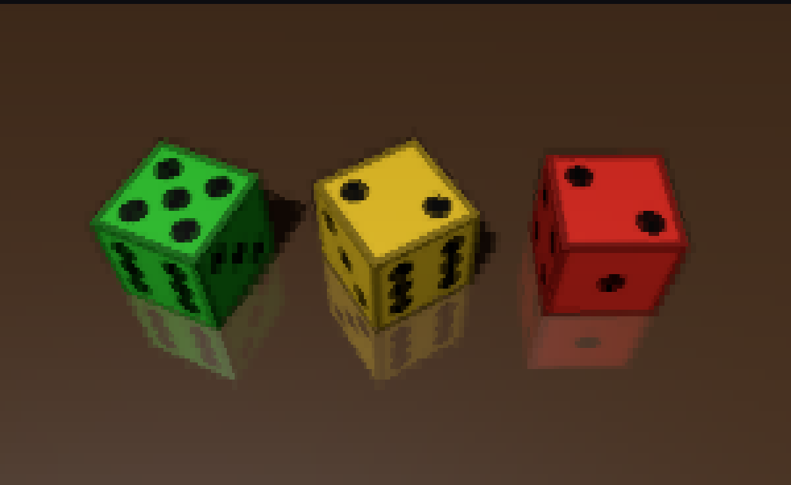
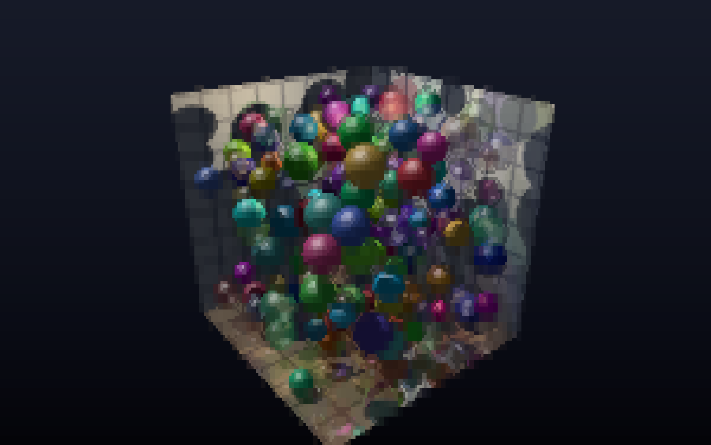
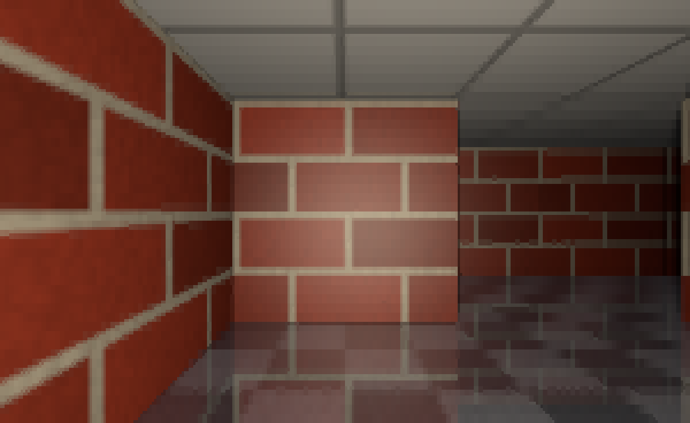
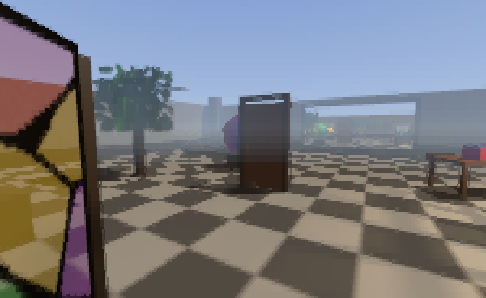
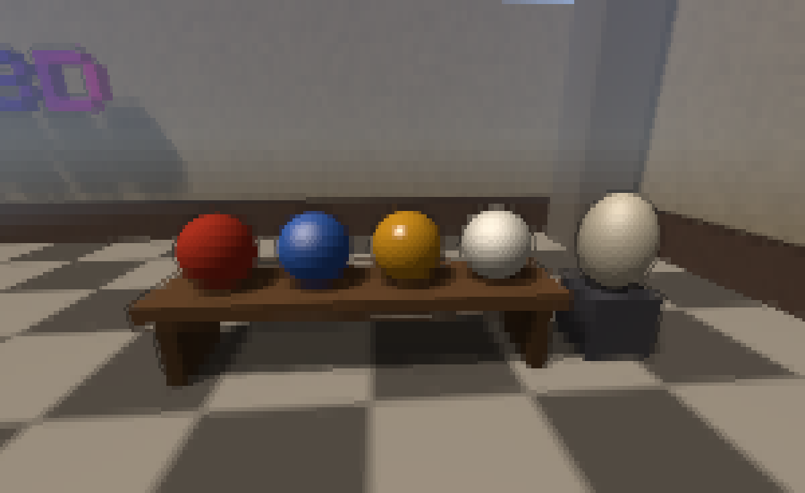
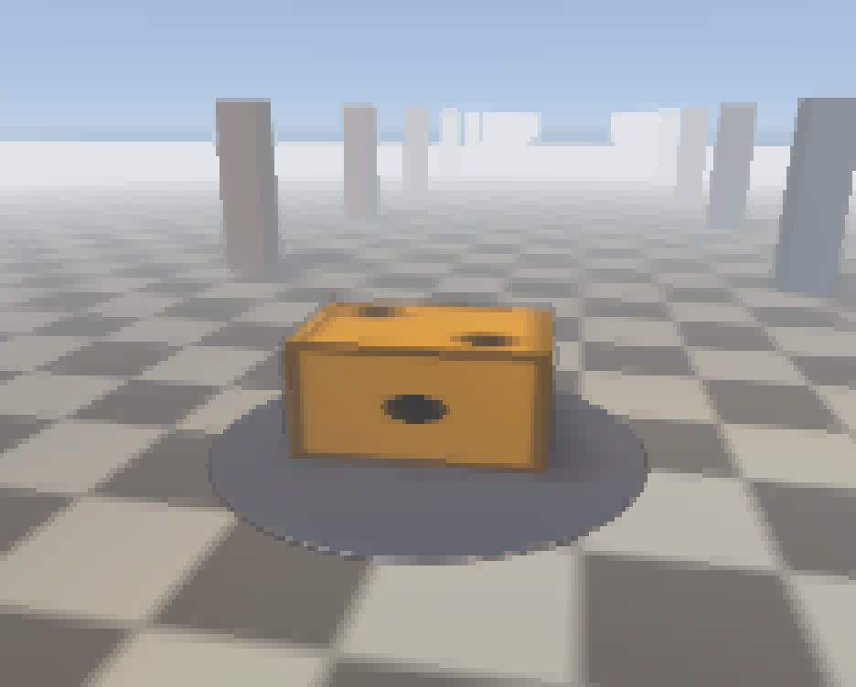

# unicode3d

A 3D renderer for the terminal, written in Python with numpy and [Numba](https://numba.pydata.org).
It draws with Unicode block characters in 24-bit colour, falls back to 256 or 16 colours and to
ASCII where it must, and runs in Windows Terminal and in Linux and macOS terminals, with no curses.
It has textures, shadows, glass, mirrors, fog, a scene graph, glTF and OBJ models with their
animations, ray and overlap queries, labels and widgets, and draws a typical frame in a few
milliseconds. It started as a Python port, in spirit, of
[ShakedAp/ASCII-renderer](https://github.com/ShakedAp/ASCII-renderer).

Used by [Zombie Dice](https://github.com/arp-Trosh/zombieDice). For how it works inside, read
[How unicode3d works](docs/how-it-works.md).

## Gallery

Every picture is real output: the characters and colours unicode3d sends to a terminal (sextant
glyphs, truecolor), drawn cell by cell.


*The room demo: a walk-around courtyard with a lamp and the sun both casting shadows, a trellis, dice
in a glass case, stained glass and a sign.*

| | |
|:-:|:-:|
|  |  |
| *The dice demo: dice rolled onto a polished table* | *The balls demo: 160 balls, some glass, over a mirror floor* |
|  |  |
| *The maze demo, its floor polished* | *The courtyard: stained glass, a tree, a chrome ball, a door, and the mirror on the far wall* |
|  |  |
| *Materials in the courtyard: rubber, paint, gold and pearl, and an egg (a sphere, stretched)* | *The workshop demo: a die made gold, squashed, and set in mist* |

More pictures, with how each effect is made, are in [How unicode3d works](docs/how-it-works.md).

Click a heading below to open that section.

<details>
<summary><h2 id="install">Install</h2></summary>

Python 3.10 or later; numpy, Numba and Pillow (for loading images) come with it. In a game, pin a released version (a git tag)
in `requirements.txt`:

```text
unicode3d @ git+https://github.com/arp-Trosh/unicode3d@v0.19.0
```

To work on the engine and a game together, install your local copy of the engine in the game's
virtual environment in editable mode, so the game always runs your latest engine code. Here the
game is in `~/your-game` and the engine in `~/unicode3d`; use your own paths:

```sh
cd ~/your-game
python -m venv .venv && . .venv/bin/activate    # Windows: .venv\Scripts\activate
pip install -r requirements.txt
pip install -e ~/unicode3d                       # replaces the pinned copy with your working tree
```

The first run compiles the renderer, which takes about 10 seconds (see [First run](#first-run)).

</details>

<details>
<summary><h2 id="demos">Demos</h2></summary>

```sh
python3 -m unicode3d [-n DICE] [--seed N]                # dice roll demo: space rolls, +/- dice count, q quits
python3 -m unicode3d.examples.viewer [model]             # model viewer: .obj, .gltf or .glb, with animations (WASD/arrows, q/e spin, Esc)
python3 -m unicode3d.examples.balls [-n BALLS]           # balls bouncing around a room, with a settings panel
python3 -m unicode3d.examples.maze [--size N]            # the Windows 98 maze screensaver
python3 -m unicode3d.examples.room                       # walk around a courtyard of things to look at (WASD)
python3 -m unicode3d.examples.workshop                   # try materials, scale, fog and animation on one object
python3 -m unicode3d.examples.tactics [--seed N]         # an isometric tactics board (orthographic camera; o compares)
```

Every demo takes the [display options](#display-options), `--fps` included, and shows the display
settings at the bottom right: F2 cycles the glyph set, F3 the colours, F4 the target frame rate
(shown as achieved/target), F5 switches shadows on and off, F6 reflections, and F7 the detail between
high (every model as it is, the default) and standard (levels of detail: objects small on screen drawn
from simpler copies, see `Renderer.simplify`), and F8 the quality (high as set, mid, low, or auto: see
[automatic quality](#automatic-quality)), and each can be clicked too (where the status line is short of room, detail
and quality aren't drawn there, but F7 and F8 still work). A small font and a large terminal give the most detail.

- **dice** (`python3 -m unicode3d`): textured dice that tumble onto a table, casting shadows, and
  land on a chosen face; f changes what they are made of (plastic, rubber, chrome, pearl), g makes
  them glass, m polishes the table so that it mirrors them.
- **viewer**: spins a model (OBJ or glTF, with its materials and textures), or a die when given none,
  and plays a glTF model's animations (n moves to the next); c makes it chrome, reflecting a sky,
  and o switches to an orthographic view; `--still` stops the spin, `--double-sided` draws back faces for meshes with inconsistent winding.
- **balls**: up to 500 balls of many colours drift and bounce around a room seen from outside (the
  near walls are see-through, since only the insides of the walls are drawn). The panel on the left
  sets the number of balls, their size, the room's size and their speed, and switches collisions,
  gravity, squashing (a ball squashes along each bump and wobbles back to round), mixed materials
  (rubber, plastic, metal, pearl), glass (every third ball see-through), a mirror floor, a lamp (a
  point light and a glowing bulb) and the camera's orbit; the sun and the lamp both cast shadows,
  tinted through the glass.
  Drag the sliders, click the toggles, use their keys (shown in the panel), or Tab through them.
  Click a ball to make it glow (picking). Balls small on screen use meshes with fewer triangles, so
  hundreds stay fast. Shows: many objects, shadows, transparency, a mirror, point lights, emissive
  objects, picking, widgets, scaling along each axis, materials.
- **maze**: the camera walks a random maze, keeping a hand on the right-hand wall (or taking the
  shortest way), from the blue marker to the gold one (glowing see-through gems, bobbing), spins
  round at the exit and starts a new maze. The panel sets the size (3 to 40 cells a side), the speed
  and the thickness of the fog and what it fades into (the dark, or a haze lit by the headlamp), and
  switches the headlamp (a lantern carried beside the camera, casting shadows), the textures (off:
  flat colours per face), a polished floor that mirrors the maze, and a map. Space pauses, n starts
  a new maze. Shows: textures, a point light moving with the camera, shadows, transparency, a
  mirror, fog fading into the dark or a colour, per-face colours, animation tracks, parts of the maze
  out of view skipped whole.
- **room**: an engine showcase to walk around: an open courtyard, WASD to walk, Q/E or Left/Right to
  turn, Up/Down to look up and down. Inside are dice turning on a pedestal in a glass case, an
  orrery (a planet and its moon circling a glowing sun, built as a scene graph), a table with
  coloured cubes on it, a rainbow blob in vertex colours, a tree whose leaves dapple the ground with
  light, a trellis the lamp throws across the floor at night, a stained-glass panel casting coloured
  light, a mirror on the south wall (turn round at the start), a still pool, a chrome ball, a lamp,
  a sign, a bench of balls in four materials (rubber, paint, gold, pearl) beside an egg (a sphere,
  stretched), and a door in a frame of its own that swings open as you walk up to it and shuts
  behind you. The table and the bench are built from one cube, stretched; the orrery turns on
  looping animation tracks and the dice bob in their case. The crosshair names whatever it is on;
  clicking names what you clicked. The sun and the lamp cast shadows. The panel switches the lamp
  and the sun, picks the background (a sky, a starry sky box, a gradient or none), and sets how
  thick the fog is and whether it fades things into the background or into white mist. Walking is
  smooth in terminals that report key releases (see [Input](#input)); elsewhere a tap walks for
  about half a second. You bump into things and slide along them, and n puts names over the things
  nearby. Esc quits. Shows: nearly everything, ray and overlap queries and labels included.
- **workshop**: one object on a turntable, and a panel to change it: the object (a sphere, a cube, a
  die, a sign, a blob), its colour, its material (specular, shininess, reflectivity, opacity), its
  scale along x, y and z (0 squashes it flat, below 0 mirrors it), the fog (off, or fading into the
  background, mist or night, from a start to an end distance; rows of pillars run into it), the
  backdrop, and an easing curve. Hop (h or space) throws the object up and spins it once, the spin
  shaped by the easing curve, which is drawn under the panel. a/d orbit the camera, w/s tilt it,
  z/x zoom, r resets. Shows: materials, scaling, fog and animation, by hand.
- **tactics**: what an orthographic camera is for. A small island of terraced tiles, houses, trees
  and four pawns, seen as strategy, tactics and board games show their maps: orthographic, at the
  isometric angle, so every tile is the same size wherever it is, the grid's lines stay parallel and
  a pawn looks the same on any tile. o switches to a perspective camera framed the same way, to
  compare: near tiles grow, the lines converge, houses lean outward. Click a pawn, then a tile, and
  it hops there along the shortest way (climbing at most one level a step); the tile under the
  pointer lights up, found by a ray query along `renderer.ray()` (parallel rays, in an orthographic
  view). Names and health meters float over the pawns (dim where something hides one, and pointing
  from the screen's edge at those out of view). q/e turn the view a quarter, +/- or the wheel zoom,
  WASD or the arrows pan, Tab picks the next pawn. Shows: the orthographic camera, ray queries,
  labels, shadows, a mirror of a sea.

</details>

<details>
<summary><h2 id="display-options">Display options</h2></summary>

The display is detected automatically (see [Display detection](#display-detection)); programs that
call `add_display_args` get these flags to override it:

- `--glyphs sextant|quad|half|ascii`: how finely cells are divided. `sextant` shows the most detail
  but needs the Unicode 13 "legacy computing" block symbols, so it is the default only in terminals
  known to show them: Windows Terminal (its font, Cascadia, has them), kitty, WezTerm, foot and
  Ghostty. Everywhere else the default is `quad`, which works with any font. If you see boxes or
  question marks, use `--glyphs quad`.
- `--color truecolor|256|16|mono`: colour depth.
- `--ascii`: plain characters, for terminals without Unicode.
- `--fps N`: the frame rate to aim for (default 30).

The environment variables `UNICODE3D_GLYPHS` and `UNICODE3D_COLOR` set the same things.

</details>

<details>
<summary><h2 id="what-it-draws">What it draws</h2></summary>

In short; [How unicode3d works](docs/how-it-works.md) explains each of these with pictures.

- **Sub-cell pixels:** each terminal cell covers a small grid of pixels: 2x2 with quadrant blocks
  (`▘▝▖▗▚▞▙▟…`), 2x3 with sextants, or 1x2 with half blocks (`▀▄`). A cell shows only two colours,
  so for each cell the renderer tries every way of splitting its pixels in two and picks the glyph
  and colour pair with the least error (the approach [chafa](https://hpjansson.org/chafa/) uses).
  Edges land on the right sub-pixel while flat areas stay solid.
- **Colour output:** everything is computed in linear light and converted to sRGB at the end.
  Truecolor terminals get exact 24-bit colour. On 256- or 16-colour terminals, colours are matched
  in the OKLab colour space (so a shaded green stays green), with ordered dithering instead of
  banding.
- **Shading:** per-pixel Blinn-Phong lighting with interpolated vertex normals (smooth where a mesh
  shares vertices, flat where it doesn't, like cube faces), and a specular highlight whose strength
  and tightness each object can set (matte rubber, glossy paint, chrome). Any number of lights add
  up: directional ones (like the sun) and point lights (lamps, torches) that fade out with distance,
  each in its own colour, and objects can glow by themselves. Light levels are perceived
  brightness, so a level of 0.5 looks half as bright.
- **Shadows:** lights can cast shadows, from shadow maps (the scene's depth as seen from the light;
  six of them, a cube, all round a point light) with edges softened by percentage-closer filtering,
  over at least a pixel on screen so they look as smooth as the edges of shapes.
- **Colour:** one colour per object, or colours per face or per vertex (blended smoothly across
  each face) in the mesh itself, and textures on top.
- **Transparency:** see-through objects (glass, water, ghosts), and see-through parts of meshes or
  textures, blend in depth order whatever order they are listed in, up to 4 layers deep in each
  pixel. They show their far side through their near one, keep their highlights, grow more opaque
  at a slant as glass does, and cast shadows tinted by their colour. Textures with holes (leaves,
  fences) are cut out with smooth edges, and cast shadows with holes in them.
- **Reflections:** flat objects can be mirrors (a wall mirror, a polished floor, still water),
  showing the scene reflected in them, lit and shadowed like the rest, mirrors in mirrors included
  if asked for. Curved shiny objects (chrome, lacquer) reflect the sky or background.
- **Antialiasing:** 4 samples per pixel in a rotated-grid pattern, so near-vertical and
  near-horizontal edges get four coverage steps instead of two. Pixels whose samples disagree
  (silhouettes, creases, overlaps) get 8 more. Each pixel is shaded once per triangle, as GPUs do
  with multisampling, and partly covered pixels blend by coverage in linear light.
- **Textures:** mipmapped with trilinear filtering, at a mip level worked out for each pixel, so a
  48x48 face texture a dozen pixels across stays steady instead of shimmering as a die turns, and a
  floor is crisp close by and smooth towards the horizon. Textures repeat (tile) where texture
  coordinates go beyond 0..1.
- **Models:** glTF 2.0 files (`.gltf`, `.glb`) with their node hierarchy, PBR materials (mapped
  onto unicode3d's), textures and animations; Wavefront OBJ files with their MTL materials (colour,
  highlights, glow, opacity, textures and cut-outs).
- **Fog and depth cues:** fog by distance in the world, fading far surfaces into the sky or
  background (or a colour), or simple depth cueing; and where one surface passes in front of another
  the far side gets a dark outline.
- **Cameras:** perspective, or orthographic for isometric and top-down views.
- **Labels:** terminal text anchored to points in the scene (names, numbers, meters, markers at
  the screen's edge for things out of view), hidden behind what is in front of them.
- **Shapes and motion:** a scene graph of nodes and objects, scaling along each axis separately,
  mesh builders (extruded text, ellipsoids, boxes, cushions), and animation along keyframes with
  easing, steps or splines, in clips that move many parts at once.
- **Queries:** what a ray hits and what a sphere, capsule or box touches, against the meshes
  themselves (a tree of boxes per mesh, so a loaded level answers in microseconds), for line of
  sight, walls, the ground under a walker and clicking the world.
- **Backgrounds:** behind the scene, a colour, a vertical gradient, a sky that follows the camera
  (zenith, horizon and ground colours), or a sky box of six pictures.
- **Output:** the screen is a grid of cells, and each refresh sends only the cells that changed, as
  VT escape sequences, wrapped in synchronized-output markers where the terminal supports them.
  A colour is sent only when it changes, and in truecolor a cell whose colours moved by a single
  level is left for a moment (`color_tolerance`), which halves the output for busy scenes.
  Under `run()`, a frame is sent from a thread of its own while the next one is drawn, so a
  terminal slow to take in big frames costs less frame rate.
  There is no curses: on Windows the console is put in VT mode, and keys and mouse clicks are read
  as console input records.
- **Speed:** the per-pixel work (projecting and clipping triangles, rasterizing, shading, fog and
  outlines, matching glyphs, encoding the output) is plain Python loops that Numba compiles to
  machine code, split across CPU cores where it pays. All objects go through one kernel call rather
  than one each, meshes shared by many objects are stored once, and objects wholly outside the view
  are skipped before any of their triangles are touched. The renderer keeps its working arrays from
  frame to frame rather than allocating new ones. Triangles crossing the camera's near plane are
  clipped rather than dropped.
- **Stability:** NaN or infinite numbers anywhere in a scene (positions, colours, lights, textures),
  degenerate cameras and terminals from one cell to a million are drawn around, never crashed on;
  mesh arrays that don't fit together are refused with a `ValueError` rather than read past; and a
  crash log records anything that does go wrong.

</details>

<details>
<summary><h2 id="using-it-in-a-game">Using it in a game</h2></summary>

`run()` takes over the terminal and calls your frame function about `fps` times a second; a
`Renderer` draws objects into pixels, and `screen.draw_frame()` turns them into cells:

```python
from unicode3d import Camera, Color, Key, Light, Object3D, Renderer, make_box, run

cube = Object3D(make_box(), color=Color.CYAN)   # or color=(r, g, b)
renderer, camera, light = Renderer(1, 1), Camera(), Light()

def frame(screen, dt, keys):
    if ord("q") in keys or Key.ESC in keys:
        return False                                     # stops run()
    rows, cols = screen.size()
    renderer.resize(cols, rows - 1, screen.cell_pixels)  # cell_pixels depends on the glyph set
    screen.erase()
    screen.draw_frame(renderer.render([cube], camera, light))
    screen.text(rows - 1, 0, "q quits", Color.YELLOW)
    screen.refresh()

run(frame, fps=30)
```

`Camera(position, target, up, fov=50, near=0.1, far=100)` looks from `position` at `target`.
`Camera(..., projection="ortho", size=10)` is orthographic: things are the same size however far
off, in a view `size` units of the world tall, as in isometric and top-down games, board games and
technical drawings (the tactics demo shows why; it and the viewer switch with `o`). Fog, outlines,
`pick()` and `ray()` then measure from the camera's plane, and `ray()` gives parallel rays starting
there. `camera.basis()` gives the unit vectors towards the right and top of the picture and straight
ahead, and `camera.height_at(distance)` how tall the view is that far ahead. A camera can also be an
object's `parent`, to keep the object in front of it wherever it goes (3D lettering over the scene, a
held lantern): in the camera's space x is to the right, y up and -z ahead, so
`Object3D(mesh, position=(0, 0, -5), parent=camera)` stays in the middle of the view, 5 units off.
Objects take a `Mesh` (build one from `vertices` and `faces`, or use `make_box` or the
[shapes](#shapes); `load_model` loads a whole [model](#models) with its materials), and a pose:
`position`, `rotation` (a quaternion, w first; `transforms.quat_axis_angle(axis, angle)` makes one)
and `scale`.

Textures (for `make_box`, or any mesh with `uvs` and `materials`) are 2D arrays of brightness
multipliers or `(H, W, 3)` colour arrays, both 0..1 in sRGB, where 1.0 leaves the object's colour
unchanged and 0.0 is black; `(H, W, 4)` adds opacity (see [Transparency](#transparency)).
`load_image(path)` reads a PNG, JPEG or any other image Pillow knows as one. Texture coordinates
(`mesh.uvs`, `(u, v)` for each corner of each face) run as in OBJ files and OpenGL: u from the
image's left edge (0) to its right (1), v from its bottom (0, the array's last row) to its top (1,
row 0, the first row of the image file); `load_gltf` flips glTF's v, which runs down. Coordinates
beyond 0..1 repeat the texture: 0 to 10 across a floor tiles it ten times.

The [Engine reference](#engine-reference) below covers each part in detail, and the programs in
`unicode3d/examples/` show them in use.

</details>

## Engine reference

Each part of the engine, in its own section.

<details>
<summary><h3 id="display-detection">Display detection</h3></summary>

`Screen` picks a glyph set and colour depth unless told otherwise (arguments, the
`--glyphs`/`--color` flags from `add_display_args`, or `UNICODE3D_GLYPHS`/`UNICODE3D_COLOR`):

| setting | chosen when |
|---------|-------------|
| `truecolor` | `COLORTERM=truecolor` or `24bit`, Windows Terminal (`WT_SESSION`), any Windows console, or a known truecolor terminal (kitty, WezTerm, Alacritty, foot, Ghostty, iTerm2, VS Code, ...) |
| `256` | `TERM` contains `256` |
| `mono` | `NO_COLOR` is set or `TERM=dumb` (glyphs then default to `ascii`, which still shows shading) |
| `16` | anything else |
| `sextant` glyphs | a terminal known to show sextants whatever the font: Windows Terminal (`WT_SESSION`), kitty, WezTerm, foot or Ghostty (by `TERM`, `TERM_PROGRAM` or their own variables) |
| `quad` glyphs | any other terminal with a UTF-8 locale (always on Windows) |
| `half` glyphs | the Linux text console (`TERM=linux`), whose fonts lack quadrants |
| `ascii` glyphs | no UTF-8 |

A program can't ask a terminal which characters its font has (a missing one still takes a cell,
drawn as a box), so sextants are picked by terminal, never by guessing at fonts.
`console.shows_sextants()` holds the list.

</details>

<details>
<summary><h3 id="renderer">Renderer</h3></summary>

`Renderer(width, height, cell_pixels=(1, 2), ...)` options, each also an attribute you can change
between frames:

| option | default | effect |
|--------|---------|--------|
| `cell_pixels` | `(1, 2)` | pixels per cell; pass `screen.cell_pixels` to `resize()` every frame, since it follows the glyph set |
| `cell_aspect` | `0.5` | a cell's width divided by its height |
| `samples` | `4` | samples per pixel: 1, 4, 8 or 16 |
| `edge_samples` | `8` | extra samples in pixels whose samples disagree: 0, 4, 8 or 16 |
| `fog` | `0.3` | a `Fog` (see [Fog](#fog)), or a number: how much the farthest surfaces are dimmed relative to the nearest (depth cueing); 0 for none |
| `outline` | `0.55` | how much the far side of a depth edge is darkened |
| `lod_bias` | `-0.5` | added to texture mip levels: lower is sharper, higher is softer |
| `background` | `None` | drawn behind the scene (see [Backgrounds](#backgrounds)); `None` leaves it empty, so the screen's background shows |
| `shadow_size` | `1024` | texels across the shadow map of each `Light` (see [Shadows](#shadows)) |
| `point_shadow_size` | `256` | texels across each of the six faces of a `PointLight`'s shadow map |
| `shadow_softness` | `1.5` | how far shadow edges are blurred, in shadow-map texels either way |
| `shadows` | `True` | `False` draws no shadows whatever the lights say (a graphics setting) |
| `transparency_layers` | `4` | see-through surfaces each pixel can show in front of the solid ones (see [Transparency](#transparency)) |
| `reflections` | `True` | `False` draws no reflections whatever the objects' reflectivity (see [Reflections](#reflections)) |
| `mirror_bounces` | `1` | how deep mirrors show each other, at most 4 |
| `max_pixels` | `1920 * 1080` | the most pixels drawn; a bigger view is drawn at a lower resolution and stretched to fit (see [Performance](#performance)); `None` for no limit |
| `shading` | `"cell"` | how often surfaces are lit: `"cell"` once per terminal cell for each surface in it (a cell's pixels end up as two colours anyway), but pixel by pixel in cells a shadow's edge crosses, colours and textures still per pixel; `"pixel"` every pixel on its own (exact); `"coarse"` everything once per cell, textures too (fastest, texture detail inside cells lost; see [Performance](#performance)) |
| `simplify` | `0` | how many pixels a simpler copy of a mesh (a level of detail) may differ by where it is drawn in the mesh's place, for objects small on screen (see [Performance](#performance)); 0 draws every mesh as it is |

`render(objects, camera, lights)` takes one light or a list of them. It returns the renderer's own
`FrameBuffer`, which the next render reuses; `copy()` it to keep a frame. `fb.ids` tells you which
object (its index in the render list plus one) covers each pixel. `renderer.project(point)` gives
the cell a world point landed on (see [Labels](#labels) for text placed there). An unchanged scene isn't drawn again:
`render()` hands back the last frame, and `renderer.draws` counts only the renders that rasterized.
After editing a mesh's arrays in place, call `renderer.invalidate()`.

</details>

<details>
<summary><h3 id="picking">Picking</h3></summary>

`renderer.pick(x, y)` tells what the last render drew in cell `(x, y)` of its frame (cells count
from the frame's top-left, so subtract where you drew it, e.g. from a `MouseEvent`): a `Pick` with
`object` (the `Object3D` itself), `position` (the point on its surface, in the world) and
`distance` from the camera, or `None` where nothing was drawn. `renderer.ray(x, y)` gives the line
of sight through a cell as `(origin, direction)`, for aiming at things that aren't drawn, such as an
imaginary floor plane.

```python
for ev in events:
    if isinstance(ev, MouseEvent) and ev.pressed and ev.button == MouseEvent.LEFT:
        hit = renderer.pick(ev.x, ev.y - top)
        if hit:
            selected = hit.object
```

`pick()` answers what the last frame drew. To ask about the world as it is now, including things
off screen or not drawn at all, use ray and overlap queries.

</details>

<details>
<summary><h3 id="labels">Labels</h3></summary>

Text anchored to points in the scene, drawn as terminal text (sharper than anything textured at
terminal resolution): names over characters, damage numbers, meters (a character's health, say),
markers on things off screen. `screen.label(renderer, point, text, color, top=0, left=0)` writes `text` centred on the
cell the point landed on in the renderer's last frame (drawn at `top`, `left`), `dy` rows lower,
and returns an `Anchor`, or `None` if it wrote nothing:

```python
screen.draw_frame(fb, top=1)
for enemy in enemies:
    head = enemy.position + (0.0, 1.2, 0.0)
    if screen.label(renderer, head, enemy.name, Color.RED, top=1, owner=enemy):
        a = renderer.anchor(head)
        screen.bar(1 + a.y + 1, a.x - 3, 6, enemy.health)   # a meter under the name
screen.label(renderer, goal, "goal", Color.YELLOW, top=1, clamp=True, hide=False)
```

- A point behind something drawn is hidden (the depth buffer says so); `owner` (an object, objects
  or a Model) is what the point belongs to, whose own surface doesn't hide it. `hide=False` writes
  the label anyway.
- A point behind the camera or outside the frame gets nothing, unless `clamp=True`, which puts the
  label at the frame's edge in the direction the point lies, kept whole inside the frame.
- `renderer.anchor(point, owner=None, clamp=False)` is the part without the text: an `Anchor` with
  the cell (`x`, `y`, from the frame's top-left), `distance` from the camera, `hidden`, and `edge`
  (moved to the edge), for drawing something else there.
- A meter drawn at an anchor (`screen.bar`, see [Screen and run()](#screen-and-run)) shows a
  level beside the name: health, charge, progress.
- To put a label just above a thing, take the top of its box in the world: `obj.world_bounds()`
  (and `model.world_bounds()`) give its corners `(low, high)` as it stands now, through its
  parents, and `union_bounds(objects)` the box around several. A bounding sphere's radius puts the
  label far too high over anything long and flat.

The room demo's `n` puts names over the things nearby.

</details>

<details>
<summary><h3 id="queries">Ray and overlap queries</h3></summary>

`Colliders(objects)` is a set of objects (and Models) to ask questions about: what a ray hits
(line of sight, bullets, the floor under a walker, clicking the world) and what a sphere, capsule
or box touches (walls, pickups). It reads where its objects are when made and on each `update()`:
call that after moving things, once a frame, for any number of queries.

```python
walls = Colliders([*level, door, *crates])
...
walls.update()
hit = walls.raycast(eye, forward, max_distance=20, ignore=[player])
if hit:
    print(hit.object, hit.position, hit.normal, hit.distance)
walker += walls.push_out(walker, 0.3)                            # out of anything it walked into
ground = walls.raycast(feet + (0, 0.5, 0), (0, -1, 0))            # what it stands on
under_mouse = walls.raycast(*renderer.ray(ev.x, ev.y - top))      # clicking the world
```

- `raycast(origin, direction, max_distance=inf, ignore=(), all=False)` gives the nearest `Hit`
  (`object`, `position`, `normal` on the side the ray came from, `distance`, `face`, and `front`:
  whether it met the face's outside), or `None`. With `all=True`, every hit along the ray, nearest
  first.
- `raycast_many(origins, directions, max_distance=inf)` casts many rays at once on all cores and
  returns arrays: objects (`None` for a miss), distances (`inf`), positions, normals and faces.
- `overlap_sphere(centre, radius)`, `overlap_capsule(a, b, radius)` (the points within `radius`
  of the segment a-b: the usual shape for a character) and `overlap_box(centre, size, rotation)`
  give `Contact`s, deepest first: `object`, `point` (on the face), `normal` (which way to move the
  shape out), `depth` (how far) and `face`. Faces of one object pushing nearly the same way give
  one contact, so a sphere in a corner of a room gets one for each wall.
- `push_out(centre, radius, end=None)` is the move that takes a sphere (or a capsule from
  `centre` to `end`) out of everything it cuts into. Sliding, gravity and steps are up to the game;
  the room demo's walker is a capsule pushed out along the ground.

Being in a set is what makes something solid. `visible` and `opacity` don't matter, so an
invisible box can stand in for a detailed model (as one stands in for the room demo's pool), and
holes in textures count as solid. Rays hit faces from either side. Separate sets work as layers
(walls, enemies, pickups), and `ignore=` passes over objects such as the one casting the ray.
Objects can be added to or taken out of `colliders.objects` before an `update()`.

Each mesh gets a bounding volume hierarchy, a tree of boxes around its triangles, built the first
time a set holding it updates (0.07 s for 140,000 triangles) and shared by every object and set
that uses the mesh, so a big level is indexed once. A query then costs about 10 µs from Python,
and `update()` about 7 µs an object. After editing a mesh's arrays in place, call
`colliders.invalidate()`. An object with a pose that isn't finite, or scaled to nothing, is never
hit, and faces with a corner at NaN, or with no area (their corners on a line, as triangle strips and
polygon fans leave), are left out.

</details>

<details>
<summary><h3 id="scene-graph">Scene graph and scale</h3></summary>

An `Object3D`'s `position`, `rotation` and `scale` are relative to its `parent`, if it has one: a
`Node` (a transform with no mesh, for grouping) or another `Object3D`. Children move, turn, scale
and hide with their parent, through any number of levels. Only the objects to draw go in the render
list; their parents are followed automatically.

- `obj.world_matrix()` gives `(linear, position, visible)` in the world: a point `p` of the mesh is at
  `linear @ p + position`.
- `obj.to_world(point)` places a point given in the object's own space.
- `obj.world_transform()` gives `(position, rotation, scale, visible)`.

Each `Object3D`, `Node`, `Model` and `Mesh` is equal only to itself, so lists of them work with `in`
and `remove()` (`hit.object in enemies`), and they can be set members and dict keys.

`scale` is one number, or three (`(x, y, z)`) that stretch the mesh along its own axes before it is
turned: `make_box()` with `scale=(2, 0.1, 1)` is a plank, a sphere with `(1, 1.5, 1)` an egg, and a
negative scale mirrors the shape. Lighting follows the stretched surface. A parent's scale stretches
its children along the parent's axes, so a child turned inside a parent stretched unevenly is
sheared: `world_matrix()` gives that exactly, while `world_transform()`'s rotation and scale can only
approximate it.

```python
import numpy as np
from unicode3d import Color, Node, Object3D, make_box
from unicode3d.shapes import blob_mesh, block_mesh
from unicode3d.transforms import UP, quat_axis_angle

car = Node(position=np.array([0.0, 0.0, 0.0]))
body = Object3D(block_mesh((0, 0.5, 0), (2, 0.6, 1)), color=Color.RED, parent=car)
wheel = blob_mesh((0.3, 0.3, 0.12))
wheels = [Object3D(wheel, np.array([x, 0.3, z]), parent=car) for x in (-0.7, 0.7) for z in (-0.55, 0.55)]
car.rotation = quat_axis_angle(UP, heading)   # the whole car turns
trailer = Object3D(make_box(), np.array([-2.0, 0.5, 0.0]), scale=(1.6, 0.8, 1.0), parent=car)  # a stretched box
renderer.render([body, *wheels, trailer], camera, light)
```

</details>

<details>
<summary><h3 id="many-objects">Many objects</h3></summary>

Draw as many objects as you like in one render list: objects that share a `Mesh` share its packed
copy, all objects are projected in one parallel kernel call, and those wholly outside the view are
skipped. Objects may come and go from one frame to the next (an arrow fired, a puff of dust): each mesh
keeps its packed copy, and meshes showing the same texture array share one copy of its mipmaps, so a
render list that changes costs milliseconds, not a pause. 400 small balls (140,800 triangles) take about 14 ms at 180x50 cells (see
[Performance](#performance) for the machine). For thousands of static pieces, merging them into one
mesh with `merge_meshes` (keeping each part's colour) is cheaper still, and a loaded model that
stands still (scenery, a building, a tree) draws quicker as `model.bake()` (see [Models](#models)).
For objects that are small
on screen, a mesh with fewer triangles looks the same and costs less (the balls demo switches meshes
by size).

</details>

<details>
<summary><h3 id="shapes">Shapes</h3></summary>

`unicode3d.shapes` builds meshes to use with `Object3D`:

- `text_mesh(text, font=fonts.PIXEL)` extrudes text in a bitmap font and returns `(mesh, width)`.
  `fonts.PIXEL` has every printable ASCII character (capitals 7 rows tall, lower case with
  descenders, 9 rows in all); a font of your own is `{char: ["#..#", ...]}`, every glyph the same
  height (`fonts.font()` builds one from compact rows). `blocks=True` makes each pixel a box of its
  own, `gap` apart, for stone or brick lettering (12 triangles a box, in reading order, so each can
  take its own colour in `face_colors`). `bitmap_mesh(cells)` does the same for any boolean grid.
- `blob_mesh(radii, center)` is an ellipsoid, with an optional bump function.
- `block_mesh(center, size, rotation)` is a box.
- `pillow_mesh(shape)` puffs a 2D inside/outside function into a cushion, with texture coordinates
  that line up with the shape.
- `merge_meshes(meshes, colors=None)` joins meshes into one, keeping their colours (opacity
  included) or giving each part the colour listed for it, and their textures and normals (faces
  of untextured meshes get a plain white texture).

`unicode3d.mesh` has `Mesh` and `make_box(size, textures=None)`.

</details>

<details>
<summary><h3 id="models">Models</h3></summary>

`load_model(path)` loads a glTF 2.0 file (`.gltf` with its `.bin` and images, or a single `.glb`),
or a Wavefront `.obj` file with the `.mtl` files it names and their textures, as a `Model`: its
parts (`Object3D`s), all under `model.root` (a `Node`), so that moving, turning, scaling or hiding
the root does it to the whole model. Pass the parts to `render()`; a model unpacks into them:

```python
from unicode3d import load_model

ship = load_model("models/ship.glb").fit(2.0)    # centred, and 2 units across at its widest
ship.root.position = np.array([0.0, 1.0, 0.0])
for warning in ship.warnings:                    # a texture that isn't there, say: left out
    print(warning)
fb = renderer.render([*ship, ground], camera, lights)
```

For several of one model, load it once and copy it: `model.copy()` gives another with parts, nodes
and animations of its own (posed as the original is now, its clips with their own clocks), sharing
the meshes, textures, materials and keyframes, so a copy costs a fraction of a millisecond and
little memory. Its root hangs from the same parent as the original's.

For a model that stands still, `model.bake()` gives the same picture from a few big meshes instead
of dozens of small parts, which draws quicker: a new `Model` whose root is posed and parented as the
original's, with the parts that look alike (the same `specular`, `shininess`, `emissive`,
`double_sided`, `cast_shadows`) merged into one mesh in root's space, each part's colour multiplied
into its mesh's colours. See-through and reflective parts, and those with holes in their textures,
keep a mesh each; hidden parts are left out. A baked model has no nodes or animations, so bake a
pose (a tower, a fallen tree), and `copy()` the result for more of it. Castle Panic's 64-part tower
bakes into 6 parts that draw the same, to within a sample at the parts' edges.

```python
goblin = load_model("goblin.glb").fit(1.0)
horde = [goblin.copy() for _ in range(10)]
for i, g in enumerate(horde):
    g.root.position = np.array([i * 1.5, 0.0, 0.0])
    g.animations["Walk"].time = i * 0.1          # out of step with each other
```

glTF is the format to prefer: it is Blender's own export, loads fast (its arrays go straight into
numpy), and keeps a model's parts, their hierarchy and its animations:

- **Nodes:** each node of the file's scene becomes a `Node`, or the `Object3D` itself where it has
  a mesh of one part, placed by its translation, rotation and scale (or its matrix) under its
  parent. `model.nodes` has them by name: move, turn or hide `model.nodes["Door"]` and what hangs
  from it goes too. `model.names` lists the parts by node, mesh and material name.
- **Meshes:** positions, normals (flat where a mesh has none, as glTF asks), texture coordinates,
  vertex colours, triangles, strips and fans, sparse and quantized data, and morph targets at their
  default weights. Skinned meshes load in the pose their joints give them. Points and lines are
  skipped. Two nodes using one mesh share it.
- **Materials** are physically based in glTF, and map approximately onto unicode3d's: the base colour
  (and its texture) is the colour; rough surfaces get no highlights, smooth ones tight bright ones
  (`specular`, `shininess`); metal reflects (`reflectivity`), much less when rough, since reflections
  here take no tint from the metal; `emissiveFactor` gives `emissive`; `alphaMode` `OPAQUE`, `MASK`
  (cut out at `alphaCutoff`) and `BLEND` (see-through) are solid, cut-out and see-through; and
  `doubleSided` draws back faces. Extensions read: `KHR_texture_transform`,
  `KHR_materials_emissive_strength`, `KHR_materials_unlit`, `KHR_mesh_quantization` and
  `EXT_texture_webp`. Normal, occlusion and metallic-roughness maps are ignored (a terminal's pixels
  would show little of them), and textures repeat whatever their sampler says.
- **Animations** come as `model.animations`, by name: each a `Clip` (see [Animation](#animation))
  moving the nodes along their translation, rotation and scale keyframes, with linear, step or
  cubic-spline interpolation. Skinned and morph-target animation aren't supported: those meshes
  stay in the pose they loaded in, and `model.warnings` says so.
- **Refused:** a file that needs Draco or meshopt compression or KTX2 textures raises `ValueError`
  saying which, rather than loading wrong; so does one that isn't glTF 2 or is broken in its
  structure. Smaller problems (a missing image, a broken accessor) leave that piece out, with a
  warning. Cameras and lights in the file aren't loaded.

```python
robot = load_model("robot.glb").fit(2.0)
wave = robot.animations["Wave"]
wave.loop = "loop"

def frame(screen, dt, keys):
    wave.update(dt)
    robot.nodes["Head"].rotation = quat_axis_angle((0, 1, 0), head_turn)  # parts move by hand too
    ...
```

From an OBJ file, `load_model` makes an `Object3D` for each material:

- **From the OBJ:** positions (and colours, where each `v` line has r g b after x y z), texture
  coordinates, normals, polygons (split into triangles), negative indices, `usemtl` and `mtllib`,
  groups and smoothing groups (without normals in the file, faces in no smoothing group are flat).
- **From the MTL:** `Kd` is the colour, `Ks` (its average) the highlight strength (`specular`),
  `Ns` the `shininess`, `Ke` (its brightest channel) `emissive`, `d` or `Tr` the `opacity`, and
  `illum` 0 or 1 turns highlights off. `map_Kd` is the texture (`-s` and `-o` scale and move it),
  `map_d` its alpha: holes or see-through parts. From the PBR extension, `Pm` (metal) gives
  `reflectivity`, less for a rough one (`Pr`), and `Pr` sets the shininess if `Ns` doesn't.
  Texture paths are relative to the MTL file; Windows backslashes, and paths from the machine the
  model was made on, are found by the file's name.
- `split_groups=True` makes a part for each group (`o` or `g`) and material, so that parts can move
  on their own (a door, a wheel); `model.names` lists the parts by group and material name.
- `double_sided=True` draws the backs of faces, for models whose faces don't all wind the same way
  (OBJ or glTF).
- Texture files (OBJ or glTF) are also looked for by name beside the model, and in the folder above
  it (a kit's models often share a `Textures` folder).
- Textures are shrunk to at most 1024 texels across (`max_texture`): a terminal shows few pixels,
  and a 4096x4096 texture would take about a gigabyte once mipmapped.

`load_obj(path)` loads the same file as one `Mesh`, with the materials' colours and textures but
not their other settings. Meshes take normals from a file, or from you: `mesh.normals` (one per
vertex) replaces the ones worked out from the faces, so that a model's texture seams (where it has
separate vertices) needn't show as creases. `mesh.check()` raises a `ValueError` if a mesh's arrays
don't fit together (a face naming a vertex that isn't there, a colour or texture coordinate too few
or too many); the renderer checks each mesh it draws.

</details>

<details>
<summary><h3 id="colours">Colours</h3></summary>

`Object3D.color` takes a named `Color` or an `(r, g, b)` triple (0..255 ints or 0..1 floats). A mesh
can carry its own colours: `mesh.face_colors` (one per face) or `mesh.vertex_colors` (one per
vertex, blended smoothly across each face, in linear light). Like textures, they multiply the
object's colour, so give the object `color=(255, 255, 255)` to show them as they are; the default
colour is a light grey. A fourth column is opacity (see [Transparency](#transparency)).

```python
terrain = Mesh(vertices, faces)
terrain.vertex_colors = np.where(vertices[:, 1:2] > 2.0, (240, 240, 250), (60, 140, 50))  # snow above 2
```

</details>

<details>
<summary><h3 id="lights">Lights</h3></summary>

Pass `render()` a list of lights and their light adds up.

- `Light(direction, ambient=0.3, diffuse=0.7, specular=0.35, shininess=24, color=(255, 255, 255),
  shadows=False)` is light from far away, the same everywhere (the sun). `direction` is the way the
  light travels. See [Shadows](#shadows).
- `PointLight(position, color=(255, 255, 255), diffuse=0.8, specular=0.35, shininess=24,
  range=10, ambient=0, shadows=False)` spreads from a point and fades smoothly to nothing at `range`.
- `Object3D.emissive` is light a surface gives off itself: `1.0` shows its colour at full brightness
  whatever the lighting (a lamp's bulb, a screen, a glowing marker). It lights nothing else; put a
  `PointLight` beside it for that.

Levels (`ambient`, `diffuse`, `specular`) are perceived brightness from 0 to 1, and a light's colour
scales them channel by channel. The highlight takes the light's colour, so lower `specular` for
large flat faces that would otherwise wash out, or set it per object (see [Materials](#materials)).
Each light costs a little shading time per pixel; point lights cost nothing where they are out of
range.

```python
lights = [Light(ambient=0.15, diffuse=0.3), PointLight(np.array([0.0, 2.5, 0.0]), color=(255, 200, 140), range=8)]
bulb = Object3D(blob_mesh((0.15, 0.15, 0.15)), np.array([0.0, 2.5, 0.0]), color=(255, 230, 180), emissive=1.0)
```

</details>

<details>
<summary><h3 id="materials">Materials</h3></summary>

A light's `specular` and `shininess` set its highlights everywhere; each object can change them for
itself, so that a rubber ball and a chrome kettle under the same lamp look different:

- `Object3D.specular` (default 1) multiplies every light's `specular` on this object: 0 for matte
  things (cloth, stone, rubber), more than 1 for glossier ones than the lights are set for.
- `Object3D.shininess` (default `None`: each light's own) is how tight the highlight is, the
  Blinn-Phong exponent: about 5 is broad and soft, 30 plastic or paint, 100 or more a pin-point, as
  on metal.

Together with `color`, `reflectivity` (see [Reflections](#reflections)), `opacity` (see
[Transparency](#transparency)) and `emissive`, they make up a surface's material. They cost nothing
measurable.

```python
rubber = Object3D(ball, color=(200, 60, 40), specular=0.0)
paint = Object3D(car_body, color=Color.RED, specular=1.5, shininess=30)
chrome = Object3D(kettle, color=(220, 220, 230), specular=2.5, shininess=120, reflectivity=0.7)
```

</details>

<details>
<summary><h3 id="shadows">Shadows</h3></summary>

`shadows=True` on a `Light` or a `PointLight` makes objects block that light from whatever lies
behind them, where only its `ambient` light still reaches. Every object casts shadows unless it
has `cast_shadows=False`: use that for a lamp's own bulb (which would otherwise shadow
everything from the light inside it), or for a room with a ceiling, which would keep the sun
out. Surfaces facing away from the light are in their own shadow.

Each shadowed light draws the scene once more, as seen from the light, into a shadow map. A
`Light`'s is `shadow_size` x `shadow_size` texels and covers every object (larger is sharper and
slower; spread over a big scene, texels get coarser). A `PointLight`'s is a cube of six
`point_shadow_size` x `point_shadow_size` faces looking every way from it, holding whatever is in
its range. A map is only redrawn when an object or its light moves, so walking the camera around
a still scene costs little; and while some things move, the rest (solid things that haven't moved
for 30 frames) are kept in a map of their own, which each frame starts from, so only what moves is
drawn again (in Castle Panic, the board and its towers: shadows 6.0 to 2.7 ms a frame). At 180x50 cells, a shadowed sun over a few dice adds about 1.2 ms to a
frame when something moves, and about 0.5 ms when nothing but the camera does. `shadow_softness`
blurs edges further; they are always smoothed over at least a pixel on screen.
`renderer.shadows = False` switches all shadows off, as F5 does in the demos
(`DisplayControls(renderer=...)`).

```python
sun = Light(direction=np.array([0.5, -1.0, -0.3]), shadows=True)
room = Object3D(room_mesh, cast_shadows=False)  # lets the sun in; what is inside still casts shadows
lamp = PointLight(np.array([0.0, 2.5, 0.0]), range=8, shadows=True)
bulb = Object3D(blob_mesh((0.15, 0.15, 0.15)), lamp.position, emissive=1.0, cast_shadows=False)
```

</details>

<details>
<summary><h3 id="transparency">Transparency</h3></summary>

`Object3D(..., opacity=0.3)` makes an object see-through: 1 (the default) is solid, 0 is not drawn
at all. A mesh's `vertex_colors` or `face_colors` can also carry opacity, as a fourth column
(0..1 or 0..255, like the colour, but not gamma-encoded), which multiplies the object's: a pane
that fades out towards one edge, or a model with some faces clear.

See-through surfaces blend over what is behind them in order of depth, whatever order the render
list has, including where they cross each other. Each pixel shows up to `transparency_layers`
(4) of them in front of the solid surface there, the nearest ones if there are more. A see-through
object always shows its back faces, so the far side of a glass box shows through its near side.
Highlights stay at full strength however clear the surface is, and surfaces grow more opaque when
seen at a slant, as glass does; below an opacity of 0.25 both fade too, so that an object faded to
0 disappears. What a pixel shows first is what `pick()` finds, so a click on a window picks the
window.

With shadows, light through a see-through object is dimmed and tinted by it: through clear glass
nearly all of it gets through, through red glass red light does, and through nearly solid glass
little does.

Textures can carry opacity too, as a fourth channel: `(H, W, 4)` arrays, alpha 0..1 (0 is a hole).
What it is for is worked out from the texture:

- **Cut-outs**, mostly solid or clear with at most soft edges between (leaves, a fence, lettering, a
  window frame): drawn as solid surfaces with holes, each sample of a pixel testing the texture, so
  the edges of the holes are smoothed like the edges of shapes, and far away, where a texel is
  smaller than a pixel, the holes thin out gradually rather than flickering. They cost no
  transparency layers, and cast shadows with holes in them.
- **Translucent textures**, where more than a tenth is partly see-through (stained glass): drawn with
  the see-through surfaces, the texture's alpha multiplying the object's, and casting light tinted
  pane by pane.

Shrunk (mipmapped), a texture's colour is averaged over what is there, not over its holes, so the
edge of a leaf stays green rather than darkening. Anything with holes or see-through parts shows
its far side through them.

Scenes without see-through objects cost nothing extra. Otherwise the cost grows with the screen area
that see-through surfaces cover: three glass dice, covering about an eighth of a 180x50 view, add
about 2.5 ms.

```python
glass = Object3D(make_box(), color=(200, 225, 255), opacity=0.15)  # a faintly blue glass case
pane.mesh.vertex_colors = [(255, 255, 255, 255), (255, 255, 255, 0), ...]  # solid on one side, clear on the other
```

</details>

<details>
<summary><h3 id="reflections">Reflections</h3></summary>

`Object3D(..., reflectivity=0.8)` makes an object reflect, from 0 (not at all, the default) to 1 (a
perfect mirror). What it reflects depends on its shape:

- **Flat meshes** (all faces on one plane: a wall mirror, a polished floor or table top, still
  water) are mirrors. The renderer draws the scene again from the camera reflected in the mirror's
  plane, into just the pixels the mirror covers, and blends it in by the reflectivity: everything in
  front of the mirror, lit, shadowed, see-through and cut out as usual, with the background beyond.
  Only solid objects are mirrors; a flat see-through one reflects the background, like a curved one.
- **Curved meshes** (chrome, polished metal, lacquer) reflect the background (the sky, sky box,
  gradient or colour) in the direction each point reflects the view, but not other objects.
- **See-through surfaces** reflect the background at a slant anyway, as glass and water do, whatever
  their reflectivity: the extra opacity they gain seen edge-on shows the sky.

`mirror_bounces` sets how deep mirrors show each other. With 1 (the default), a mirror seen in a
mirror shows the background reflected in it rather than the scene: enough unless strong mirrors face
each other. Up to 4 draws deeper images, each an extra pass, but stops early where an image covers
fewer than 50 pixels or its reflectivities multiply to less than 5%, so even an infinity mirror
costs only a few passes. `renderer.reflections = False` switches all reflections off, as F6 does
in the demos.

Each mirror on screen costs a pass: about 1.5–2 ms at 180x50 cells, plus the drawing of the pixels
it covers (a floor mirror under three dice adds about 3 ms in all). Curved shiny objects cost
almost nothing extra. A mirror off screen, or hidden, costs nothing.

```python
mirror = Object3D(flat_mesh, reflectivity=0.9)       # flat: shows the scene
pool = Object3D(water_mesh, color=(40, 70, 80), reflectivity=0.6)
chrome = Object3D(blob_mesh((1, 1, 1), rings=24, segments=32), reflectivity=0.85)  # curved: the sky
renderer = Renderer(80, 24, background=Sky(), mirror_bounces=2)
```

</details>

<details>
<summary><h3 id="fog">Fog</h3></summary>

`Renderer(fog=Fog(start, end, color=None))`, or `renderer.fog = Fog(...)` at any time: surfaces
nearer the camera than `start` (in world units) are clear, and farther ones fade until, at `end` and
beyond, they are gone. With `color=None` they fade into whatever is behind them: the sky's horizon
behind a distant hill, a gradient, or, with no background, the terminal's own (they give up their
coverage, so it shows through). Behind a sky box they fade into the sky blurred, so that its fine
detail (stars, say) doesn't show through a fogged wall. A colour (a named `Color` or `(r, g, b)`) fades them into
that instead: white mist, black night. Distance is measured from the eye, so a surface keeps its fog
as the camera turns or as other things come into view or leave it. `pick()` still finds what the fog
hides.

A plain number instead of a `Fog` keeps the older depth cueing (the default, `0.3`): surfaces dim by
how far back they sit between the nearest and farthest thing on screen. It needs no sense of scale,
which suits single objects such as dice, but it shifts as things come into view, and it dims rather
than fading into the sky. `0` switches fog off.

```python
renderer = Renderer(80, 24, background=Sky(), fog=Fog(start=10, end=60))   # haze into the sky
renderer.fog = Fog(start=2, end=20, color=(0, 0, 0))                        # darkness
```

</details>

<details>
<summary><h3 id="backgrounds">Backgrounds</h3></summary>

`Renderer(background=...)`, or `renderer.background = ...` at any time:

- a colour: fills everything the scene leaves empty;
- `Gradient(top, bottom)`: fixed on screen, top row to bottom row;
- `Sky(zenith, horizon, ground)`: by the direction each pixel looks in, so it moves as the camera
  turns: the horizon colour at eye level, fading up to the zenith and quickly down to the ground;
- `SkyBox(textures)`: six pictures (in `+X, -X, +Y, -Y, +Z, -Z` order, `(H, W)` brightness or
  `(H, W, 3)` colour) on the inside of a box that moves with the camera, so it never gets nearer.
  The sides are upright; the top continues upward from the top edge of the `-Z` picture and the
  bottom downward from its bottom edge (`background.SKYBOX_FACES` has the exact axes).

The background fills in behind edges in proportion to how much of each pixel the scene leaves
uncovered, so antialiased silhouettes blend into it. It is not outlined, and a `Fog` without a
colour fades surfaces into it.

</details>

<details>
<summary><h3 id="animation">Animation</h3></summary>

`unicode3d.animation` moves things smoothly without each game writing its own maths:

- `quat_slerp(a, b, t)` (in `transforms`) turns steadily from rotation `a` to `b`, the short way round;
  `lerp(a, b, t)` blends numbers or arrays.
- Easing curves map 0..1 onto 0..1 to shape a move: `linear`, `ease_in`, `ease_out`, `ease_in_out`,
  `ease_out_back` (overshoots and settles, like a door against its stop), `ease_out_bounce` (lands
  and bounces), `step` (holds, then jumps at the next keyframe); `EASINGS` has them by name.
- `Track(keys, easing=linear, loop="once")` holds keyframes `(time, value)`, values numbers or arrays
  (a position, a scale, a colour), and `track.at(t)` blends between them. A keyframe given as `(time,
  value, easing)` eases the stretch leading up to it. `loop` is `"once"` (hold the ends), `"loop"` or
  `"pingpong"`. `RotationTrack` does the same for quaternions, with `quat_slerp`.
- `SplineTrack(keys, loop="once", rotation=False)` curves through keyframes `(time, value,
  in_tangent, out_tangent)` (cubic Hermite splines, as glTF animations use); `rotation=True` for
  quaternions.
- `Animation(obj, position=None, rotation=None, scale=None, speed=1)` moves an `Object3D` or `Node`
  along tracks: call `anim.update(dt)` every frame (it returns whether it is still playing), or
  `anim.apply(t)` for a time of your own.
- `Clip(animations, name="", loop="once", speed=1)` plays several `Animation`s on one clock, from 0
  to the end of the longest, and does the looping for them all (`"once"`, `"loop"`, `"pingpong"`):
  a loaded glTF model's animations are clips, and they group your own as well. It has `update(dt)`,
  `apply(t)`, `done()`, `duration` and `targets`. A clip samples all its tracks in one compiled
  kernel (a 55-part character in about 35 µs a frame, not 0.5 ms), with the same numbers as
  `track.at(t)`; so it reads a track's keyframes once: to change them, give the animation a new
  `Track` rather than editing one in place. Tracks with an easing function or a `Track` subclass of
  your own are played as before, through `at()`.
- `clip.start(fade=0)` plays a clip from the beginning; with `fade` (seconds), it eases from the
  pose its targets have now into its own over that long (positions and scales blended, rotations
  slerped, along `ease_in_out`), so switching from one clip to another doesn't jump:
  `model.animations["Attack"].start(fade=0.2)`, then `update(dt)` it as usual (`clip.fading` says
  whether it still is). The fade runs on `update()`'s `dt`, whatever the clip's `speed`.

```python
from unicode3d.animation import Animation, RotationTrack, Track

door = Animation(door_obj, rotation=RotationTrack([(0.0, closed), (0.8, opened, "ease_out_back")]))
bob = Animation(gem, position=Track([(0, (0, 1.0, 0)), (1, (0, 1.3, 0))], "ease_in_out", loop="pingpong"))

def frame(screen, dt, keys):
    door.update(dt)
    bob.update(dt)
    ...
```

</details>

<details>
<summary><h3 id="screen-and-run">Screen and run()</h3></summary>

`run(frame_fn, fps=30, glyphs=None, color=None, mouse=False, background=None, title=None,
key_release=False)` takes over the terminal (naming its window `title`, if given) and restores it
however the loop ends (Ctrl-C raises `KeyboardInterrupt`; `kill`'s SIGTERM exits as `sys.exit()`
would, unless the program handles that signal itself). `frame_fn(screen, dt, keys)` returns
`False` to stop. `keys` holds ints (a character's code, or a `Key` such as `Key.UP`, `Key.ENTER`,
`Key.ESC`), `MouseEvent`s and, with `key_release=True`, `KeyRelease`s (see [Input](#input)).

- `screen.text(y, x, s, color, bold=False, reverse=False, dim=False, bg=None)` writes text. A named
  `Color` is one of the terminal's own ANSI colours, so text follows the user's theme; `(r, g, b)`
  (0..255 ints or 0..1 floats) is that colour, exactly in truecolor and as the nearest palette
  entry in 256 or 16 colours. `bg` sets the cells' background the same way (a card's face, a
  highlighted row); `None` leaves the screen's. In mono, text keeps the terminal's colours, and
  `reverse` sets it apart. Characters that aren't exactly one cell wide are shown as `?`.
  `screen.label()` takes `color` and `bg` the same way.
- `screen.bar(y, x, width, fraction, color=Color.GREEN, empty=Color.DEFAULT)` draws a meter: a bar
  `width` cells long filled `fraction` (0..1) of the way, to an eighth of a cell (`#` and `-`
  without Unicode), for progress and levels of any kind (loading, memory or disk in use, a volume,
  a frame-time gauge, a character's health over its [label](#labels)).
- `background=(r, g, b)` fills the screen with a known colour so antialiased edges blend into it
  exactly; by default, edges blend toward black over the terminal's own background.
- `screen.set_glyphs(name)` and `screen.set_color(mode)` switch modes while running
  (`screen.glyph_modes` lists the glyph sets the terminal can take).
- `screen.fps` is the target frame rate, which `run()` re-reads every frame (0: as fast as it can);
  `screen.measured_fps` is the rate it achieved over the last second.
- `screen.color_tolerance` (truecolor only; default 1): a cell whose character and style are the
  same and whose colours moved by at most this many levels (of 255) is not sent again. That sends
  half the cells for 400 small spinning balls, and a fifth for one big sphere, which counts most
  over SSH. The terminal is then up to that many levels off, less than half a just-noticeable
  difference at 1, and only for a moment: the cells still off are sent once the picture stops
  changing, or after 30 refreshes. 0 sends every change.
- `screen.refresh()` sends what changed in the grid. Under `run()` it returns once the changes are
  worked out, and they are written to the terminal while the next frame is drawn; the grid is
  free to change as soon as it returns. At most one frame is on its way at a time, so a slow
  terminal lowers the frame rate rather than falling behind. With 200 KB frames and a terminal
  taking in 20 MB a second, that is about a quarter more frames; terminals that read quickly
  (kitty, and most where a frame fits in the system's buffer) gain little.
- `Screen(size=(rows, cols))` with no console gives an off-screen grid, for tests;
  `render_updates()` returns the escape sequences a refresh would send.
- `screen.picture(cell=(8, 16), fg=(204, 204, 204), bg=(12, 12, 16))` is a screenshot: the cells
  as they are now, as a terminal would show them, an `(rows * 16, cols * 8, 3)` uint8 sRGB image
  with block glyphs, box-drawing lines and block elements drawn as their shapes and text in a small
  font (symbols it lacks, such as arrows, come from DejaVu Sans or Noto Sans Symbols where installed;
  `fg` and `bg` stand for the terminal's own colours). `PIL.Image.fromarray(screen.picture()).save("shot.png")` saves it, for
  previews, docs and tests; it works on a screen with a console as well as an off-screen one.

`run()` notes each run, with the terminal's size and settings, in a crash log
(`crash_log_path()`: `~/.cache/unicode3d/crash.log`, or `%LOCALAPPDATA%\unicode3d\crash.log` on
Windows). If the program stops with an error, the traceback goes there as well as to the screen
(which a tiny font can make unreadable), and a crash of Python itself leaves a stack trace there.
When reporting a crash, include that file.

</details>

<details>
<summary><h3 id="input">Input</h3></summary>

**Mouse.** `run(mouse=True)` reports clicks and the wheel as `MouseEvent(x, y, button, pressed,
moved)`; `mouse="drag"` adds moves while a button is held (`moved=True`, `pressed=True`), which
dragging a slider needs; `mouse="move"` reports every move (with `button=MouseEvent.NONE` when no
button is held), for hover effects.

**Holding keys.** Most terminals send only key presses, and a held key repeats: once, a pause of
about half a second, then steadily. That is fine for menus but makes "walk while W is held" stutter.
`screen.held` (a `HeldKeys`) tells which keys are down, and `"w" in screen.held` is the way to ask:

```python
def frame(screen, dt, keys):
    if "w" in screen.held:
        player.walk(speed * dt)
```

With `run(key_release=True)` the engine asks the terminal to report releases too, and passes them
on as `KeyRelease(key)` events:

| terminal | held keys |
|----------|-----------|
| kitty, foot, Ghostty, Alacritty, iTerm2, Rio; WezTerm with `enable_kitty_keyboard = true` | exact: presses and releases come through the kitty keyboard protocol |
| Windows (Windows Terminal and the console) | exact: the engine asks Windows for the state of each held key |
| everything else | estimated: a key counts as held for half a second after its press, and then for as long as its repeats keep coming. A tap moves a player for up to half a second, and on many systems holding a second key stops the first one repeating |

`screen.held.exact` says which you have. Letters are tracked without case, so Shift+W still holds
W. With the kitty protocol on, Ctrl-C arrives as a key, and `screen.keys()` raises
`KeyboardInterrupt` for it as usual.

</details>

<details>
<summary><h3 id="widgets">Widgets</h3></summary>

`unicode3d.ui` has text widgets that work with the mouse and keyboard: `Button(label, action,
key=None)`, `Toggle(label, value, key=None)`, `Slider(label, value, lo, hi, step=1, keys="[]")` and
`Choice(label, options, key=None)`. A `Panel` lays them out in a row (or a column, with
`vertical=True`) and handles a frame's events: clicks, drags, the mouse wheel, each widget's own key,
and Tab/Shift-Tab to move the focus followed by Left/Right/Enter/Space. It returns the events it
didn't use, so the rest of the program sees only those. Each widget calls `on_change(value)` when
the user changes it, or you can read `widget.value` every frame.

`DisplayControls()` is the display settings panel from Zombie Dice: glyphs on F2, colours on F3 and
the frame rate (achieved/target) on F4, each also clickable; `DisplayControls(renderer=renderer)`
adds shadows on F5, reflections on F6, detail on F7 ("standard" sets `renderer.simplify` to 1,
"high" to 0) and quality on F8 (below). Draw it every frame; its `width` stays fixed as the values
change. `DisplayControls(show=("fps",))` draws only the frame rate, while all the keys still work (for
a program with a settings page of its own, built from `controls.glyphs`, `controls.fps` and the
others). `controls.settings()` gives the values as a dict ready for JSON, and `controls.apply(values)`
puts them back on the next run, skipping any this terminal can't take; where to keep them is up to the
program.

<a id="automatic-quality"></a>**Quality presets and automatic quality.** F8 (or `DisplayControls(renderer=renderer, quality=...)`,
or `controls.apply({"quality": ...})`) picks a preset. "high", the default, leaves the renderer as set
(benchmarks and tests stay repeatable). "mid" turns edge samples off (edges stay smoothed, more coarsely),
draws levels of detail at 2 pixels and fits sun shadow maps to the whole scene rather than the view (coarser
shadows, cheaper to draw: `Renderer.shadow_fit`), keeping the shading. "low" also shades coarsely (everything once per
cell: texture detail inside a cell is lost) and draws the picture at 70% of its pixels, stretched (softer).
Shadows and reflections are never turned off, and presets only ever go below the settings as the user (or the
program) set them, which are what F7 and `settings()` show. "auto" chooses among them by the frame rate:
"high" while frames come at 27 a second or more (`AutoQuality.high_fps`), "mid" at 20 or more (`min_fps`: a
game aiming at 30 plays well at 20) and "low" below that; the bar shows "auto mid" while it is on mid. It
judges about a second of frames at a time (`run()` times each frame, `screen.frame_time`, without the wait for
the frame rate) and moves down at once; as frames drawn in one preset say little of another's, it learns how
much dearer each preset is than the next one down from the frames either side of each move, and moves up when
the better one is expected to clear its frame rate by 10% for 3 s, waiting longer each time a move up doesn't
hold, so it settles instead of flickering. The same works without `DisplayControls`:
`AutoQuality.of(renderer).update(frame_seconds, 1 / fps)` once a frame (`unicode3d.quality`).

```python
from unicode3d.ui import Button, DisplayControls, Panel, Slider, Toggle

count = Slider("Balls", 20, 1, 400, keys="[]")
spin = Toggle("Spin", True, key="s")
panel = Panel([count, spin, Button("Reset", reset, key="r")])
controls = DisplayControls()

def frame(screen, dt, events):
    events = controls.handle(panel.handle(events), screen)
    ...
    rows, cols = screen.size()
    panel.draw(screen, rows - 1, 1)
    controls.draw(screen, rows - 1, cols - controls.width - 1)
    screen.refresh()

run(frame, mouse="drag")
```

</details>

<details>
<summary><h3 id="performance">Performance</h3></summary>

Drawing a frame and building its screen update takes about 1.5 ms for a 60x15-cell view of three
rolling dice, and about 3.2 ms for a 180x50 view in `sextant` mode. Cost grows with the pixel count
and, more slowly, the triangle count: a 27,000-triangle sphere filling a 180x50 view takes about
4.3 ms, and 400 separate balls (140,800 triangles) about 14 ms. Shadows, see-through surfaces and
mirrors cost more where they are used (see [Shadows](#shadows), [Transparency](#transparency) and
[Reflections](#reflections)); the room demo, with all of them, takes about 16 ms a frame at 180x52
cells while turning. A scene that hasn't changed since the last `render()` (same objects, poses,
camera, lights, background and size) isn't drawn again, so still frames cost almost nothing. The
terminal showing the frame usually takes longer than drawing it, and isn't included.

These times are from `python -m benchmarks.bench` (median of 40 frames, the scenes spinning, output
built but not written to a terminal) on this machine:

```text
CPU:      AMD Ryzen 5 5600X 6-Core Processor (12 logical cores)
Threads:  12 (Numba's tbb threading layer)
System:   Linux 7.2.7-arch1-1 (x86_64)
Software: Python 3.14.7, NumPy 2.5.3, Numba 0.67.0, unicode3d 0.8.1
Frames:   180x50 cells, sextant glyphs, truecolor; median of 40 frames, ms

scene        objects    tris   first          render      draw_frame  render_updates    total    fps  KB out
dice               3      36     6.6            2.53            0.48            0.22     3.23  309.3    29.5
dice-sun           4      38     8.2            4.43            0.53            0.27     5.24  191.0    38.7
dice-lamp          4      38     7.7            4.48            0.53            0.32     5.33  187.5    46.4
dice-glass         4      38    11.2            6.64            0.54            0.31     7.49  133.5    45.1
dice-mirror        4      38    10.1            7.12            0.53            0.32     7.99  125.2    45.6
balls-400        400  140800    18.9           12.73            0.67            0.53    13.97   71.6    76.2
sphere-3k          1    2976     4.4            2.30            0.43            0.06     2.81  356.4     2.1
sphere-27k         1   27360    13.1            3.77            0.44            0.06     4.28  233.6     1.7
```

`render` is `Renderer.render` (projecting, rasterizing and shading, shadow maps included),
`draw_frame` matching pixels to glyphs and colours, and `render_updates` encoding the changed cells
as escape sequences (`KB out` is what that sends a frame, with the default `color_tolerance` of 1);
`first` is each scene's first frame (setting up buffers, and drawing its shadow
maps), left out of the medians. The `-sun` and `-lamp` scenes have a shadowed light over a floor,
and their dice turn, so the shadow map is redrawn every frame. Run it with `--size`, `--glyphs`,
`--color`, `--threads` or `--scene` to measure other cases; its first lines say what it ran on, so
include them when quoting its numbers.

**Many detailed models.** Models made for bigger screens often have far more triangles than a terminal
can show: a 1,700-triangle character ten pixels tall costs as much to draw as a big one. With
`Renderer.simplify` above 0 (about 1 is a good start), objects small on screen are drawn from simpler
copies of their meshes, levels of detail made by `detail.detail_levels` (vertices merged on a grid,
keeping creases, colours, textures and materials), the coarsest whose vertices move by at most that
many pixels; shiny objects never take a level that would make them flat (a flat shiny mesh is a
mirror). Levels are made for a mesh the first time it is small enough to use one, a few meshes a
frame; call `detail_levels(mesh)` ahead of time (while loading, say) to have them ready. In Castle
Panic at 1 pixel it draws half the triangles and its frames are about 15% faster, the picture
changed by a shade here and there. Moving a corner a pixel or two can close the gap in a letter, or
sink a thin plate laid on another part (a shield's painted face on its back) behind it, as each part's
levels are made on their own. Give such parts `Object3D(..., simplify=False)`: they are always drawn as
they are.

**Shading per cell.** A terminal cell's pixels end up as two colours, so `Renderer.shading` works out
lighting (every light, shadows, highlights) once per cell for each surface in it, by default, and pixel by
pixel only in cells a shadow's edge may cross (a shadow lookup widened to the whole cell comes out neither
fully lit nor fully dark): shadows keep their soft edges, and highlights and light falloff vary from cell to
cell. Colours and textures are still worked out for every pixel. With several lights, shading takes a quarter
to a third less time than `"pixel"` (exact, every pixel lit on its own); `"coarse"`, everything once per
cell, about half again, but a brick's mortar or a board's grid lines go jagged. Automatic quality takes
`"coarse"` as one of its steps.

**Huge terminals.** A full-screen terminal with a tiny font can have a million cells or more: kitty
at font size 2 on a 1080p screen is about 960x215 cells, 1920x645 pixels in `sextant` mode. Frames
there take longer, and the renderer's working memory, a few hundred bytes a pixel, would grow
without limit, so `Renderer.max_pixels` (about 1080p by default) caps what is drawn: a bigger view
is drawn at the largest resolution within it and stretched to size, and `renderer.drawn_size` tells
what was drawn. The screen itself still keeps every cell, at about 700 bytes a cell in all (1.4 GB
for 1920x540 cells). `python -m benchmarks.stress` walks the room demo through sizes up to that,
resizing as it goes, and draws it from thousands of random cameras, to check that nothing breaks.

</details>

<details>
<summary><h3 id="first-run">First run</h3></summary>

Numba compiles the renderer the first time it is used. Compiling its 28 kernels one after another
takes 30 to 40 seconds, so `compile_kernels()` compiles them in several Python processes at once
(up to six, each using about 300 MB while it works), which takes about 10 seconds on a 6-core
machine. The result is cached (in `__pycache__` beside the code, or a user cache folder if that
can't be written), so later runs start in a fraction of a second. Upgrading unicode3d or Numba, or
moving to another CPU, compiles it again. (Numba checks each kernel against its own file only; on
import, unicode3d also checks the files of the helpers each kernel calls, and drops a kernel compiled
with older ones, so an upgrade never runs stale code.)

`run()` compiles before the first frame and shows "First run compile, please wait..." while it does;
programs that drive a `Screen` themselves can call `compile_kernels()` at a moment of their
choosing. In a frozen program (PyInstaller and the like), or with `UNICODE3D_NO_PRECOMPILE` set, it
compiles in the one process instead.

</details>

<details>
<summary><h3 id="threads">Threads</h3></summary>

The renderer uses every CPU core Numba finds, about twice as fast as one core at typical sizes. Set
`NUMBA_NUM_THREADS`, or call `numba.set_num_threads()`, to leave cores for other work. Frames come
out identical whatever the thread count.

A program can also draw from several threads of its own (a server drawing for each client, say),
each with its own `Renderer` and `Screen` (one of either isn't for sharing between threads). Where
Numba runs on its fallback threading layer, `workqueue` (no TBB or OpenMP installed; often so on
macOS), which would abort the program if two threads started parallel work at once, the threads
take turns instead; `pip install tbb` lets them run side by side.

Between parallel kernels a frame runs Python, and Numba's workers would spin through it, keeping every
core busy (on a laptop, holding the chip at its power limit and taking CPU from the terminal). So
importing unicode3d sets `OMP_WAIT_POLICY=PASSIVE` (and `KMP_BLOCKTIME=0`) and prefers the OpenMP
threading layer to TBB, whose workers can't be told to sleep: frames came out 6% faster on 4 cores
and 9-29% faster on 12, with half the CPU kept busy. Whatever you set yourself (those variables,
`NUMBA_THREADING_LAYER` or `NUMBA_THREADING_LAYER_PRIORITY`) is left alone; on Windows the layer is
left to Numba.

</details>

<details>
<summary><h3 id="windows">Windows</h3></summary>

Needs Windows 10 or later (for VT sequences in the console), numpy, Numba and Pillow. Windows Terminal is
recommended, and gets sextants by default; the classic console works too, with quadrants (its
default fonts may lack sextants).

</details>

## Working on unicode3d

<details>
<summary><h3 id="layout">Layout</h3></summary>

The tests, in `tests/`, use only the public API. The conventions for engine code (Numba kernels, and
the one-writer rule that keeps multithreaded rendering deterministic) are in `CLAUDE.md`. The
`examples/` programs show the engine in use; games may build on them, as
[Zombie Dice](https://github.com/arp-Trosh/zombieDice) does with `examples/dice.py`. `benchmarks/`
holds tools for working on the engine (see [Checking a change](#checking-a-change)), and `docs/`
[the article on how it works](docs/how-it-works.md) with the script that makes its pictures.

| module          | role |
|-----------------|------|
| `scene.py`      | `Camera`, `Node`, `Object3D`, `Model` (and, from their own modules, `Light`, `PointLight`, `Renderer`, `Pick`) |
| `lights.py`     | `Light`, `PointLight`, and their packing for the kernels |
| `renderer.py`   | `Renderer`: packs the scene, projects and culls it, multisampling with extra edge samples, see-through layers, fog, outlines, background, picking, `ray`, `project` and `anchor` (where a point lands, for labels) |
| `shading.py`    | shading kernels: lighting and materials, resolving samples into pixels, blending see-through layers, fog and outlines |
| `shadows.py`    | shadow maps: drawing them (for directional and point lights) and looking them up while shading |
| `mirrors.py`    | mirrors: the extra passes that draw what flat reflective objects show |
| `raster.py`     | `FrameBuffer` (linear RGB premultiplied by coverage, alpha, depth, object ids), projection of all objects at once with view culling and near-plane clipping, multi-sample z-buffered rasterizer |
| `mesh.py`       | `Mesh` with vertex normals (its own or worked out), per-vertex or per-face colours, bounding sphere and cached mipmaps, textured `make_box` |
| `models.py`     | loading models (`load_model`): OBJ files with their MTL materials and textures (`load_obj` as one mesh) |
| `gltf.py`       | loading glTF 2.0 models (`load_gltf`): nodes, meshes, PBR materials as unicode3d's, textures, animations as clips |
| `texture.py`    | loading images, mipmap chains, trilinear sampling, repeating textures |
| `queries.py`    | `Colliders`: ray casts and sphere, capsule and box overlaps against meshes, with a bounding volume hierarchy per mesh |
| `transforms.py` | projection and view matrices, quaternions, `quat_slerp` |
| `background.py` | what is drawn behind the scene: `Gradient`, `Sky`, `SkyBox`; and `Fog` |
| `animation.py`  | easing curves, keyframe `Track`s, `RotationTrack`s and `SplineTrack`s, `Animation`, which moves an object along them, and `Clip`, which plays several together |
| `shapes.py`     | mesh builders: `text_mesh` (extruded text in a bitmap font, `fonts.PIXEL` by default), `bitmap_mesh`, `blob_mesh` (ellipsoid), `block_mesh`, `pillow_mesh` (a 2D shape puffed into a cushion), `merge_meshes` |
| `fonts.py`      | bitmap fonts for `text_mesh`: `PIXEL` (printable ASCII), and `font()` to build one |
| `pictures.py`   | `cells_picture`, behind `Screen.picture()`: cells drawn as an image, for screenshots and tests |
| `color.py`      | sRGB/linear conversion, named `Color`s, OKLab palette matching, dithering, SGR colour codes |
| `glyphs.py`     | glyph sets (half, quad, sextant, ascii) and matching pixels to cells |
| `terminal.py`   | `Screen` (cell grid, text, labels, meters, frames, diffed output, held keys), `run`, `compile_kernels`, command-line display flags |
| `console.py`    | raw terminal I/O for POSIX (termios) and Windows (console API), `WindowsInput` (console key and mouse records to VT sequences), key state on Windows, colour and glyph detection |
| `keys.py`       | `Key` codes, `KeyRelease`, `MouseEvent`, the VT and kitty-protocol input decoder, `HeldKeys` |
| `ui.py`         | widgets: `Button`, `Toggle`, `Slider`, `Choice`, laid out in a `Panel`; `DisplayControls` (glyphs, colours, frame rate, shadows, reflections, detail, quality on F2-F8) |
| `quality.py`    | `AutoQuality`: the picture stepped down while frames run long, and back up (no kernels) |
| `threads.py`    | `kernel_lock()`, which keeps threads from launching parallel kernels at once where Numba's threading layer can't take it; `prefer_sleeping_workers()` |
| `precompile.py` | compiling the kernels on several cores at once on the first run (their argument types are in `kernel_signatures.py`) |
| `kernel_cache.py` | dropping cached kernels compiled with helpers (in other modules) that have since changed |
| `examples/dice.py`   | pip-textured die, `orientation_showing`, `top_face`, `RollAnimation` (result chosen first, then animated to land on it); Zombie Dice builds its dice on it |
| `examples/hud.py`    | the status line the demos share: help text and `DisplayControls` |
| `examples/demo.py`   | the dice roll demo (`python3 -m unicode3d`) |
| `examples/viewer.py` | the model viewer |
| `examples/balls.py`  | balls in a room, with a settings panel |
| `examples/maze.py`   | the maze screensaver |
| `examples/room.py`   | the walk-around courtyard |
| `examples/workshop.py` | one object and a panel of materials, scale, fog and animation to try |
| `examples/tactics.py` | the isometric tactics board (orthographic camera, ray queries, labels) |

</details>

<details>
<summary><h3 id="checking-a-change">Checking a change</h3></summary>

For work on the engine itself (see also `CLAUDE.md`):

- `python -m unittest`: the tests.
- `python -m benchmarks.gallery diff [REV]`: draws 24 reference scenes (a cube, dice in every glyph
  set and colour mode, glass, shadows, cut-outs, mirrors, a textured floor to the horizon, many
  balls, the room demo, fog, materials, stretched shapes, OBJ and glTF models, an orthographic view) with the engine as of a git revision
  (default `HEAD`) and as it is now, and says for each whether it came out identical, within
  rounding, or changed, with pictures of what changed. `save DIR` keeps a set, `compare OLD NEW`
  compares two.
- `python -m benchmarks.bench`: frame times by stage (see [Performance](#performance)).
- `python -m benchmarks.stress`: a few minutes of random walking, resizing and extreme cameras,
  before a release.
- `python -m unicode3d.precompile --update`: after changing a kernel's arguments or adding one, so
  that the first run still compiles it in parallel (a test says when it is needed).
- `python -m docs.make_figures`: redraws the pictures in the article and this README's gallery, after
  a change to how things look.

</details>

<details>
<summary><h3 id="versions">Versions</h3></summary>

Releases are git tags (`v0.1.0`, ...) following [semantic versioning](https://semver.org): a patch
release (`0.1.1`) fixes bugs, a minor release (`0.2.0`) adds features, and before 1.0 a minor release
may also change the API. `unicode3d.__version__` holds the version. The `main` branch can be ahead
of the latest tag; pin a tag in a game. To release: bump `__version__` in `unicode3d/__init__.py`,
commit, then tag it and push the tag (`git tag v0.19.0 && git push --tags`).

</details>

<details>
<summary><h3 id="license">License</h3></summary>

Copyright (C) 2026 arp-Trosh.

unicode3d is free software: you can redistribute it and/or modify it under the terms of the GNU
Lesser General Public License as published by the Free Software Foundation, either version 3 of the
License, or (at your option) any later version ([`COPYING.LESSER`](COPYING.LESSER), which builds on
the GNU General Public License in [`COPYING`](COPYING)). It is distributed in the hope that it will be
useful, but WITHOUT ANY WARRANTY; without even the implied warranty of MERCHANTABILITY or FITNESS FOR
A PARTICULAR PURPOSE.

In short: any program, open or closed, may use unicode3d. If you distribute a modified unicode3d,
your changes to it must be released under the LGPL too. A program that ships unicode3d should
include these two license files and say that it uses unicode3d, and must let its users swap in their
own version of unicode3d (with Python source files, that's automatic).

</details>

---

*Disclaimer: This project was created with Claude Code.*
