# How unicode3d works: a multisampled 3D renderer for the terminal, in Python


*The room demo, as a terminal shows it: 100x36 cells, each one a character and two colours.*

unicode3d draws 3D scenes in a terminal: textured and lit meshes, shadows from the sun and from lamps,
glass, mirrors, fog, and models loaded from glTF and OBJ files, animations included. Rather than
choosing characters while it draws, it does what a GPU does: it rasterizes the scene into an
ordinary image of small pixels, several samples each, and only at the end asks which character and
pair of colours best stands for each cell's block of pixels. It runs on the CPU, written in Python,
with the per-pixel work compiled by [Numba](https://numba.pydata.org) and split across cores.

This article follows a frame from the scene to the escape sequences sent to the terminal, and explains
the choices made along the way. All the pictures are real output, produced by
`python -m docs.make_figures` from the reference scenes in `benchmarks/gallery.py`.

## A terminal cell is a tiny display

A cell shows one character, in a foreground colour on a background colour. Most characters are no
use for pictures, but Unicode has block elements that fill parts of a cell exactly, which terminals
draw as solid shapes whatever the font:

- **half blocks** (`▀ ▄`) split a cell into 1x2 parts;
- **quadrants** (`▘ ▝ ▖ ▗ ▚ ▞ ▙ ▟ …`) into 2x2;
- **sextants** (`🬀 🬁 🬂 …`, from Unicode 13's "Symbols for Legacy Computing") into 2x3.

With sextants, every way of colouring six sub-pixels with two colours has a character. So a cell is a
2x3 pixel display with a strong limit: at most two colours at once. A 180x50-cell terminal becomes a
360x150-pixel screen, with a restricted palette in every cell.

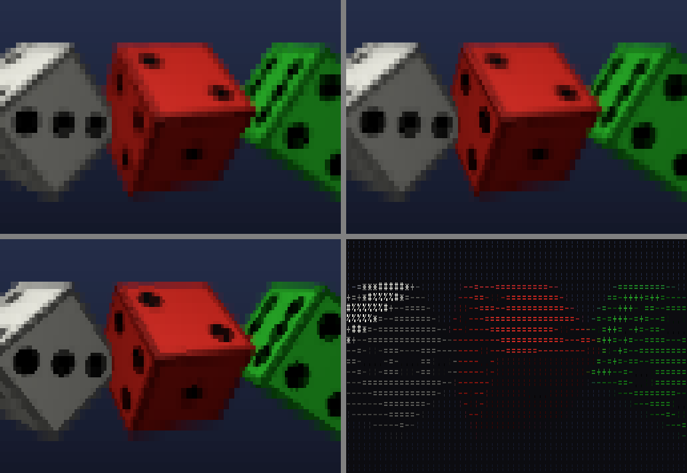

*The same frame with half blocks (1x2 pixels a cell), quadrants (2x2), sextants (2x3), and the
ASCII fallback, a brightness ramp of characters.*

The renderer treats this as two problems: first draw the best picture it can at the sub-cell
resolution, then pick characters for it. Keeping them apart means everything before the last step
is ordinary rendering, done in linear light at full precision, and the terminal's limits only
affect the last step.

## Choosing a character for each cell

For each cell, the renderer has 6 pixels (with sextants), each a colour and a coverage (how much of
the pixel the scene covered). It tries every way of splitting them into two groups (31 splits, counting a split
and its mirror image once) and the cell left whole, and gives each group the average colour of its
pixels. The best
split leaves the least squared error. That is the same as maximizing |S₁|²/n₁ + |S₀|²/n₀, where S is
the sum of a group's colours and n its size, so each split costs a few additions (the approach
[chafa](https://hpjansson.org/chafa/) uses for images). Coverage counts as a fourth colour
channel at half weight, so a silhouette's edge lands on the right sub-pixel even where the colours on
either side are alike.

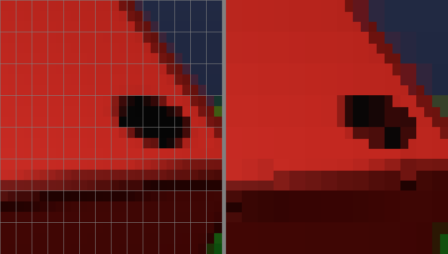

*Left: the pixels, 2x3 to a cell, as tall as the terminal makes them, with each cell's border. Right:
the character and two colours chosen for each cell.*

Two details keep this cheap and clean. A split has to beat the unsplit cell by a margin, so flat areas
stay solid: splitting them into two nearly equal colours would cost output and, in small palettes,
show up as noise. And since no split can gain more than the unsplit cell's own error, cells whose
error is already tiny skip the search entirely. In a typical frame that is most cells (empty space,
or the middle of a surface).

## Colour

Everything is computed in linear light: lighting adds up, blending and antialiasing average, and
only the final colours are converted to sRGB. Light *levels*, though, are given as perceived
brightness, so a light of 0.5 looks half as bright, as artists expect. They are decoded like any
sRGB value before use.

Truecolor terminals get the exact 24-bit result. For 256 or 16 colours, each colour is matched to the
palette in [OKLab](https://bottosson.github.io/posts/oklab/), a colour space where distance follows
how different colours look. Chroma is weighted above lightness, so a shaded green stays green rather
than going grey. A 32x32x32 lookup table makes the match a single index per cell. A 4x4 ordered
dither adds a fixed fine pattern instead of bands, and it is stable from frame to frame (random
dithering would crawl).

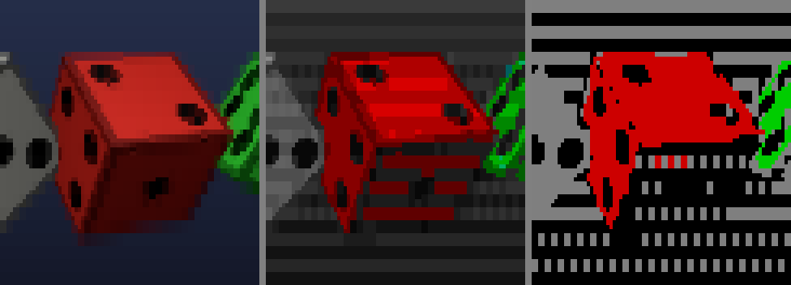

*Truecolor, 256 colours, 16 colours. The dither shows up as fine stripes in the gradient behind.*

## The pipeline

A frame goes through these stages. Each box that touches pixels or triangles is a Numba kernel.

```text
objects, camera, lights
   │  pack meshes once; each object becomes a row of arrays (pose, colour, material)
   ▼
transform ─── vertices into the world and clip space, all objects in one call;
   │           objects wholly outside the view are skipped by bounding sphere
   ▼
project ───── cull back faces, clip at the near plane, one screen-space triangle list
   ▼
bin ───────── which triangles touch each band of 4 pixel rows
   ▼
rasterize ─── 4 samples a pixel, depth-tested, per band, in parallel
   ▼
resolve ───── shade each (pixel, triangle) once; sum samples; flag pixels whose samples disagree
   ▼
edge pass ─── 8 more samples in flagged pixels only
   ▼
mirrors ───── extra passes from reflected cameras, into the mirrors' pixels
   ▼
see-through ─ up to 4 transparent layers per pixel, sorted, shaded, blended
   ▼
outlines, fog, background
   ▼
glyphs ────── characters and colours per cell;  output: only the cells that changed
```

Shadow maps are drawn before all of this, from the lights' point of view, by the same transform
kernel and depth-only versions of the project and rasterize kernels.

### Rasterizing with Numba

The heavy work is written as plain loops over numpy arrays: for each triangle, for each pixel it
covers, compute barycentric weights, test depth, and so on. Numba compiles these functions
(`@njit`) to machine code. This matters more than it might seem. The obvious numpy version, which
builds big temporary arrays of every pixel against every triangle, turned out several times slower
than the compiled loops, because it spends its time allocating and filling memory. So the rule in the
codebase is that Python only prepares arrays and calls kernels, and every new rendering feature goes
into a kernel.

Objects are not drawn one at a time. Each frame packs every object's pose into arrays, and one kernel
call transforms all their vertices, another projects all their faces. Meshes shared by many objects
(400 balls, one sphere mesh) are stored once. A game with hundreds of objects pays for Python per
object only in building those arrays.

Interpolation is perspective-correct: attributes are divided by w at the corners, interpolated
linearly on screen, and divided back. Triangles that cross the camera's near plane are clipped, not
dropped, so walking up to a wall doesn't make it vanish.

### Parallel, and the same on any number of threads

Kernels declared `parallel=True` split a `prange` loop across cores. The difficulty is the same one
GPUs face: many triangles want to write the same pixel. If threads took triangles, two could update
one pixel's depth at once, and the result would depend on timing.

So the work is split by *what is written*, not by what is read. The picture is cut into bands of four
pixel rows, and each band, run by one thread, walks through all the triangles that touch it, in
order, writing only its own rows. Triangles are first binned into bands (counted in parallel, then
laid out serially, then written in parallel), so a band only visits triangles that reach it. The
bands are handed out in a scattered order, since neighbouring bands, over the same small object,
tend to have the same amount of work.

Everything follows one rule, written down for the codebase: every array element a parallel kernel
writes is written by exactly one iteration of its loop. Reductions over the whole frame are done
serially or in per-iteration slots, and output whose size depends on the work (clipping can split a
triangle into several) is written in two passes: count, turn the counts into offsets, then write. A
test draws a crowded scene with every feature on one thread and then several times on all of them,
and requires the frames to be identical to the bit.

### Antialiasing that suits a coarse screen

At 2x3 pixels a cell, jagged edges would be glaring. Each pixel takes 4 samples in a rotated grid,
placed so that no two share a row or column, so near-vertical and near-horizontal edges get four
coverage steps instead of two. Where a pixel's samples disagree (some covered and some not, different
objects, or colours too far apart), it takes 8 more in a second pattern. Only those pixels pay: along
silhouettes, creases and overlaps.

As with GPU multisampling, each pixel is shaded once per triangle covering it, at the pixel centre;
the samples only measure coverage. Shading is the expensive part, so this keeps antialiasing cheap.

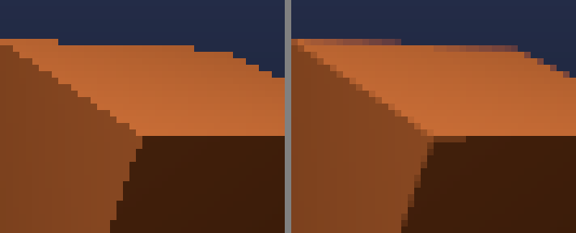

*A cube's edges in pixels, before characters are chosen: one sample a pixel (left) and the default
(right).*

### Textures and mipmaps

On a terminal a textured face is often only a few pixels across. A 48x48 die face drawn a dozen pixels
wide, point-sampled, picks a few arbitrary texels, and the picture shimmers as the die turns. Textures
therefore carry mipmaps (copies halved again and again), and each pixel picks the level where a
texel is about a pixel, blending the two nearest levels (trilinear filtering). Textures with alpha are
kept premultiplied, so shrinking a leaf averages the colour of the leaf, not of the holes around it.

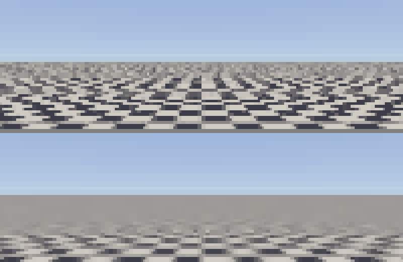

*A finely checked floor without mipmaps (top: always the finest level) and with them (bottom): far
away, the checks average to grey instead of breaking into noise.*

The level is worked out for each pixel, from how fast the texture coordinates change across the
screen there. Texture coordinates aren't linear on screen, but u/w, v/w and 1/w are (the same fact
that makes perspective-correct interpolation work), so their rates of change are exact and cheap, and
those of u and v follow from them. The level comes from the direction in which a pixel spans more
texels, as graphics hardware does. A big floor made of two triangles is then crisp close by and
smooth towards the horizon; with one level for each triangle, as the renderer once had, it was
blurred near the camera and broke into noise far away.

## Light and shadow

Shading is Blinn-Phong per pixel, with vertex normals interpolated (smooth where a mesh shares
vertices, flat where it doesn't, as on a cube). Any number of lights add up: directional ones like the
sun, and point lights that fade to nothing at their range. Objects can glow (`emissive`), and each
object has a material: `specular` scales every light's highlight on it (0 for rubber or cloth) and
`shininess` sets how tight the highlight is (a broad sheen on paint, a pin-point on chrome).

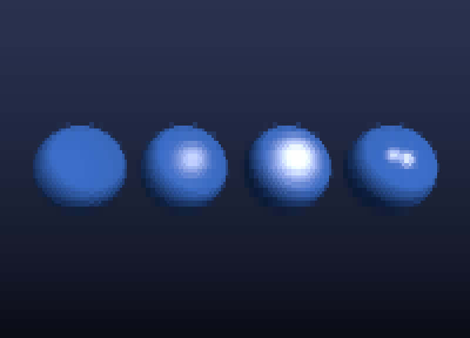

*One sphere, four materials: matte, the lights' own highlight, glossy, and tight like metal.*

Shadows come from shadow maps: the scene drawn once more from the light, keeping only depth. A
sun's map is an orthographic view of a box fitted around every object's bounding sphere, 1024x1024
texels by default. The box moves in whole texels and grows in steps of about 9%, so shadows don't
crawl as things move. A point light's map is a cube of six 256x256 views, drawn together as one atlas
in one pass, each face widened by 8 texels so filtering near an edge never has to cross into another
face.

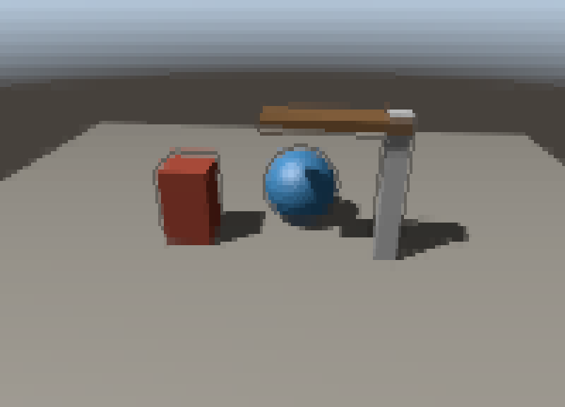 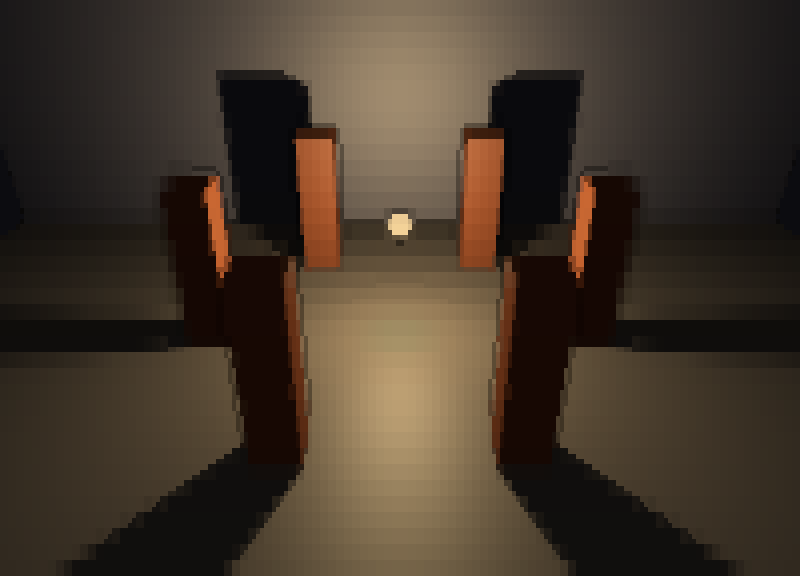

*Left: the sun. Right: a point light among pillars, its cube map sending shadows every way.*

Edges are softened by percentage-closer filtering: the map is averaged over a square around the point,
at least as wide as the pixel being shaded. That rule, filtering at least over the screen pixel's
footprint, is what makes shadow edges look as smooth as the antialiased edges of shapes, instead of
showing stair-steps from a map texel bigger than a pixel. A map is kept until something it depends on
moves, so walking the camera through a still scene costs almost nothing extra.

See-through objects cast tinted shadows: alongside the depth, a second map records what colour of
light gets through, so a red pane throws red light. Textures with holes (leaves, a trellis) cast
shadows with holes.

## Transparency

Transparent surfaces can't just be drawn in list order: blending depends on depth order, and objects
interpenetrate. unicode3d keeps, per pixel, a short list of the see-through surfaces in front of the
solid one (4 by default), sorted by depth. Each layer records which of the pixel's samples it
covered, so its edges are antialiased like everything else. Fragments of the same object within 2% of
each other in depth are merged into one layer, which removes seams where a mesh's own triangles
meet. Then the layers are shaded and blended back to front.

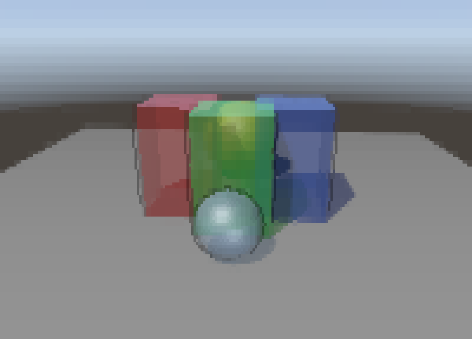

*Overlapping glass, in any order in the render list. Each pane shows its far side through its near
side, and the sun's shadows are tinted.*

Two touches make glass read as glass. Highlights stay at full strength however clear the surface
is. And surfaces become more opaque at grazing angles (Schlick's approximation of Fresnel reflection),
with the extra opacity showing the sky reflected in them. Below an opacity of 0.25 both fade out, so
an object faded to nothing disappears.

Textures with mostly on-or-off alpha (leaves, fences, lettering) are not transparent at all in this
sense: they are cut-outs, tested per sample (alpha to coverage), so their holes are antialiased like
edges and cost no layers. Textures with a lot of partial alpha, like stained glass, are blended as
layers.

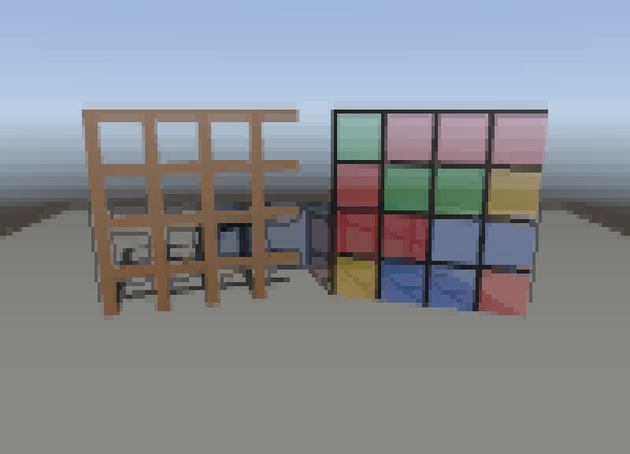

*A trellis (a cut-out texture) and stained glass (a translucent one), both casting shadows.*

## Mirrors

A flat, solid, reflective object is a mirror. For each mirror on screen, the renderer draws the scene
again from the camera reflected in the mirror's plane, clipping away everything behind that plane,
and only into the pixels the mirror covers, found as spans per band of rows. The reflection is a full
render (shaded, shadowed, with glass and cut-outs), mixed into the mirror's share of each pixel by
its reflectivity.

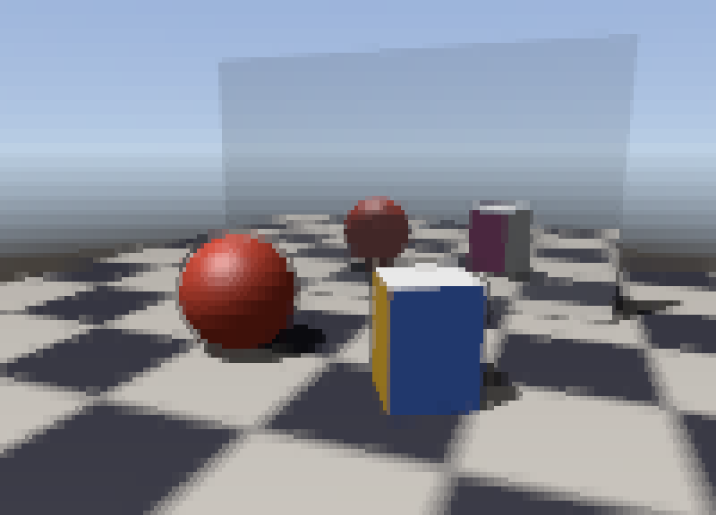 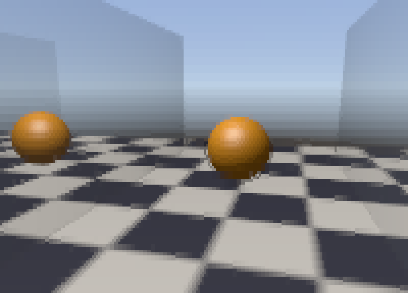

*Left: a mirror shows the far sides of things. Right: facing mirrors, three reflections deep.*

Mirrors seen in mirrors recurse, up to 4 levels deep, and each level is pruned once its image covers
fewer than 50 pixels or its reflectivities multiply to less than 5%. An "infinity mirror" costs a few
passes, not an explosion of them. Curved shiny objects can't be done this way, so they reflect the
background (sky, sky box or gradient) in the reflected view direction, which is almost free.

## Fog, and things stretched

Fog is measured in the world: surfaces fade between a start and an end distance from the eye, into the
sky or background behind them, or into a colour. Fading into "whatever is behind" is done by lowering a
pixel's coverage rather than mixing in a colour. The background fill that runs afterwards then puts
the right sky in, or, with no background at all, the terminal's own background shows through. A sky
box is the exception: its stars would show through a fogged wall as if it were glass, so there fog
mixes in the sky box blurred (a coarse mip level, about four texels across a face) in the pixel's
direction, which keeps the night's colour and loses the stars, as haze does.

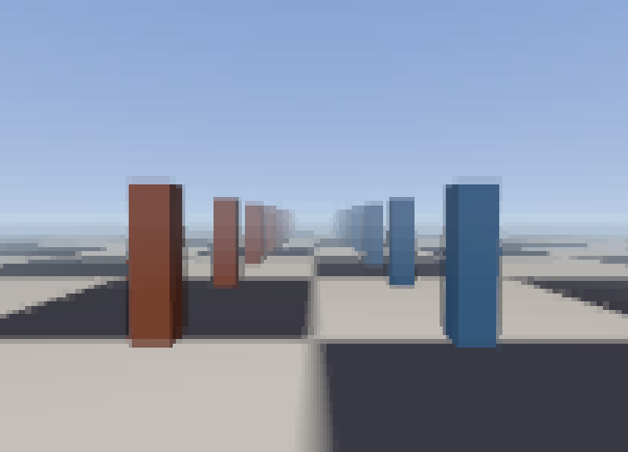

*Fog fading pillars into the sky, 4 to 40 units from the eye.*

Objects can be scaled differently along each axis. Internally each object is placed by a 3x3 matrix
(its rotation and scale, and its parents' too), and normals are transformed by that matrix's inverse
transpose, so lighting follows the stretched surface. A negative scale mirrors a shape; the renderer
notices the flipped handedness and flips which side of each face counts as the front.

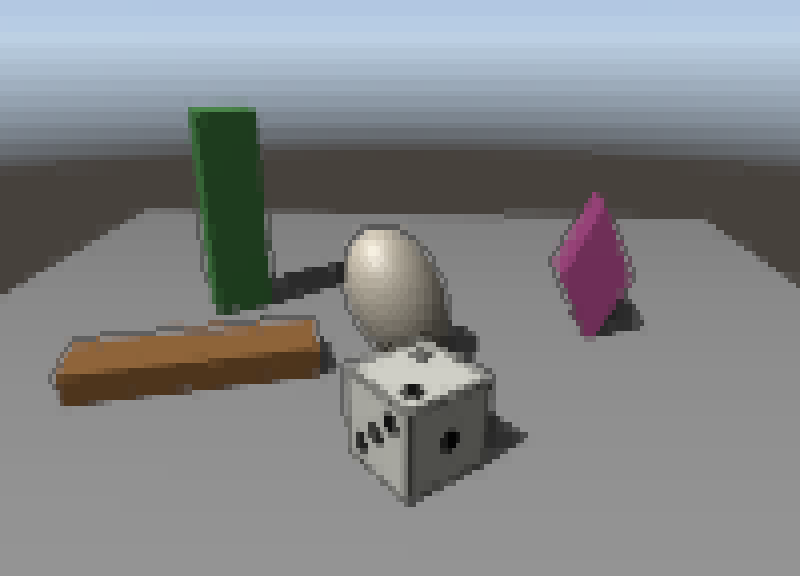

*A plank, a tall box and an egg made from a cube and a sphere; a die with a negative scale (its pips
mirrored); and a box turned inside a stretched group, which shears it.*

## Models from files

`load_model` reads glTF 2.0 (`.gltf` or `.glb`) and Wavefront OBJ with its MTL materials. glTF's
binary buffers go straight into numpy arrays, so it loads quickly. A file's node hierarchy becomes
the scene graph's nodes, and a mesh used by several nodes stays one mesh, packed once. Materials in
glTF are physically based (a base colour, roughness, metalness), and are mapped onto the renderer's
simpler ones: rough surfaces get no highlights and smooth ones tight, bright ones; metal reflects,
much less when rough. A file that uses something the loader can't read correctly, such as compressed meshes, is refused with an error naming it, rather than
drawn wrong; smaller problems, like a missing texture, become warnings and the rest loads.

A glTF file's animations become clips: keyframe tracks of position, rotation and scale (linear,
stepped or spline), all on one clock, moving the model's nodes. A door swings on its hinge node and
everything hanging from it follows.

## Orthographic views

An orthographic camera (isometric and top-down games, board games) shows things the same size however far
off. Every kernel assumes a perspective view, though: depth is 1/w, faces are clipped where w reaches the
near plane, and shading looks from the eye. Rather than a second path through all of them, an orthographic
view is drawn as a perspective one from a hundred thousand view sizes back, through an angle narrow enough
that what is `size` tall at the camera fills the picture. Things then differ in size with distance by a
hundred-thousandth at most, far under a pixel, and shading, culling, shadows and mirrors all work
unchanged. Double precision has room for it: depths that differ by a millimetre still differ by about
10^-10 of themselves, a million times more than the rounding. The only parts that care are those measuring
distance from the eye (fog, outlines, depth cueing, `pick()` and `ray()`), which subtract the distance back
and measure from the camera's plane.

## Asking about the scene

`pick()` reads the framebuffer: what the last frame drew in a cell. Programs also need to ask about the world
itself, including what isn't on screen: what a ray hits, or what a sphere or capsule around a walker cuts
into. `Colliders` answers those against the meshes. Each mesh gets a bounding volume hierarchy, a tree of
boxes around its triangles split by the surface area heuristic, built in a kernel in the mesh's own space.
It is built once and shared by every object showing the mesh, so a ray goes into each object's space through
the inverse of its matrix rather than the triangles coming out into the world. A ray tests each object's
bounding sphere first, then walks the tree; casting many at once splits them among threads, each writing only
its own rays' answers. Overlaps go the other way: the shape's box is taken into the object's space to narrow
down the tree, and the triangles left are tested in the world, where a sphere is still a sphere. Contacts
pushing out nearly the same way are merged, so a dense mesh gives a few, not thousands.

## Getting it onto the screen

The screen is a grid of cells (character, foreground, background). Each refresh compares the grid to
what was last sent and writes only the changed cells, as VT escape sequences, from a Numba kernel
straight into a byte buffer. A style is sent only as far as it changed: a new foreground on its own,
the reset only when bold, dim or reverse change. In truecolor, a cell whose colours moved by at most
`color_tolerance` levels (1 by default) is left as it is: a turning sphere changes most of its cells
by a level or so each frame, which no one can see, and leaving them saves four fifths of its output.
Those cells are sent once the picture stops changing, or after 30 refreshes, so a still picture is
always exact. The update is wrapped in synchronized-output markers, which terminals
that support them use to show the whole update at once, with no tearing. There is no curses. On
Windows the console is switched into VT mode, and keys and mouse clicks are read as console input
records.

## Staying up

A game's frame can contain NaN or infinities (a physics blow-up, a camera at a degenerate spot), and
a terminal can be one cell or a million. Neither may crash the program.

- Every kernel uses NumPy's error model, so a division by zero gives inf or NaN instead of raising an
  exception deep inside a parallel loop.
- Floats become array indices only after being clamped as floats, with comparisons that are false for
  NaN. Converting NaN to an int gives an undefined value, and Numba doesn't bounds-check, so an
  unchecked index would write outside the array.
- Objects whose pose isn't finite are skipped before any kernel sees them.
- Beyond about 1080p worth of pixels, the scene is drawn at the largest resolution that fits and
  stretched, so memory stays bounded in a full-screen terminal at a tiny font.
- `run()` keeps a crash log, with a traceback for errors and a stack trace if Python itself dies.

A stress benchmark walks the room demo through sizes from one cell to 1920x540 while resizing,
and renders it from thousands of random cameras pressed against surfaces, where clipping is most
extreme.

## How fast

On a Ryzen 5 5600X (6 cores, 12 threads) with Python 3.14 and Numba 0.67, at 180x50 cells with
sextants (360x150 pixels), drawing a frame and building its terminal update takes:

| scene | triangles | ms a frame |
|-------|----------:|-----------:|
| three textured dice | 36 | 3.2 |
| the same with a sun casting shadows (redrawn every frame) | 38 | 5.2 |
| the same in glass | 38 | 7.5 |
| the same on a mirror floor | 38 | 8.0 |
| a smooth sphere | 27,360 | 4.3 |
| 400 separate balls | 140,800 | 14.0 |
| the room demo, with everything, while turning | | 16 |

Cost follows the pixel count first and the triangle count second. Terminals take longer to show a
frame than this takes to draw it. `python -m benchmarks.bench` measures each stage and prints the
machine it ran on.

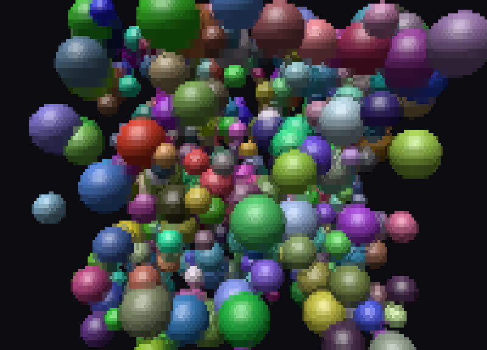

*400 separate objects, 140,800 triangles.*

Compiling is the other cost. Numba compiles on first use and caches the result, but the 28 kernels
take about 35 seconds to compile one after another, and Numba compiles one function at a time.
Because the cache is shared on disk, the first run instead starts several Pythons, each compiling a
share of the kernels (their argument types are recorded in advance in `kernel_signatures.py`), and
then loads them all from the cache: about 10 seconds on six cores. Numba updates a kernel's cache
index by reading it, adding an entry and writing it back. So each worker writes only the kernels it
was given, and compiles the helpers they call without caching them.

## Checking the picture

Unit tests check properties: the nearer object wins, shadows darken what they fall on, the frame is
the same on any number of threads. They survive deliberate changes to the look, which is their
strength, and they can miss an accidental one. So there is also `python -m benchmarks.gallery diff`,
which renders 24 reference scenes (every feature, every glyph set and colour mode) with the
engine as of a git revision and as it is now. For each scene it reports "identical", "within
tolerance" (rounding), or what changed, and saves pictures of the difference. A refactor should come
out identical. A new feature should change only the scenes it touches, which can be checked before it
is committed rather than noticed later in a demo.

## Where it stops

This is a software renderer, so it has a ceiling. Every visible triangle costs CPU time, and past a
few hundred thousand triangles a frame, frames slow down in proportion. Transparency keeps a fixed
number of layers a pixel, so a fifth pane of glass in line is dropped. Shadow maps are a fixed size
over the whole scene, so a sun over a large world gives coarse shadows. Models play only what moves
their nodes: skinned characters stand in the pose they were loaded in, and normal maps aren't read.
And the terminal is the final limit: two colours a cell, and whatever font and
colour depth it has.

Inside those limits, the approach holds up: treat the cell as a tiny two-colour display, render the
best possible image for it with the usual tools of real-time graphics, and let the character choice
come last.
